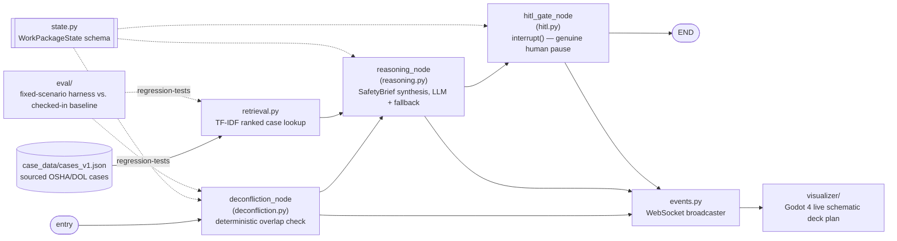

# Watchstander — Architecture

> **Status:** Living document. Update when a decision changes, a component is added/removed, or a migration phase completes.
> **Last updated:** 2026-07-31 — Research-First, Extraction-Aware policy adopted and first applied to both Extraction Candidates (ADR-020, ADR-021)

## 1. Purpose and Scope

Watchstander is a LangGraph-based multi-agent system that evaluates concurrent shipyard work packages for hazardous spatial/temporal overlap under **OSHA 1915 (Shipyard Employment)**, and gates anything flagged behind a genuine human-in-the-loop safety review. It exists to demonstrate deterministic, auditable safety reasoning grounded in real incident history — not a chatbot that talks about safety, a state machine that enforces it.

Out of scope for v1: Navy mishap data (classification/aggregation risk — deliberately excluded), any yard-specific proprietary data, and a full 3D digital twin (the spatial visualizer described in Section 8 is a 2D schematic, not a CAD-accurate model).

## 2. Design Principles

1. **Detection is deterministic, explanation is not.** `deconfliction.py`'s geometry/hazard-pair overlap check never touches an LLM — conflicts must be auditable and repeatable. The reasoning layer sits *after* that decision and only explains it; it cannot create or dismiss a conflict.
2. **Every generated brief carries its provenance.** A `SafetyBrief` is tagged `[SOURCE: LLM SYNTHESIS]` or `[SOURCE: DETERMINISTIC FALLBACK - LLM OFFLINE]`, both in its own text and as a top-level field — a reviewer must never have to guess whether a model actually reasoned about a conflict.
3. **The HITL gate blocks for real.** `hitl.py` uses LangGraph's `interrupt()` — execution genuinely pauses and waits for a decision, it does not simulate review with a stub.
4. **Grounded, never invented.** The reasoning node's system prompt and its deterministic fallback both work only from an explicit `_grounding_context()` dict assembled from already-verified state; case IDs, shipyards, dates, and outcomes are never invented.
5. **Edge-resilient by requirement.** Case retrieval (`retrieval.py`) uses a hand-rolled TF-IDF index instead of a vector DB specifically so deconfliction and citation keep working with zero network access and zero model-weight downloads — chosen over ChromaDB/FAISS + sentence-transformers for exactly that reason (see Decision Log).
6. **Public-domain case grounding only.** Every cited case in `case_data/` traces to a public OSHA/DOL record — no Navy mishap data, no proprietary yard data.
7. **Research-first, extraction-aware.** Before committing to a new subsystem, architectural pattern, or hard technical problem, do a lightweight sweep for whether the open-source/GitHub community has already solved this specific problem well — a habitual check at each genuinely new fork in the road, not a one-time ritual done at project kickoff. Default to adopting or adapting a solid existing solution rather than reinventing it; a known-good pattern from a past decision in this project is a reasonable starting hypothesis, not a permanent default, and gets re-checked when the problem's actual shape changes. When a real sweep turns up nothing solid, that's a finding, not a dead end — it's the signal to build the missing piece well and to ask whether what gets built is general enough to stand alone as its own public repo (see Extraction Candidates, Section 9). Log what was found (or that nothing solid existed) in the normal ADR entry for that decision. First adopted project-wide in SIMNAVY as ADR-007 there; adopted here as ADR-020.

## 3. Components

| Module | Responsibility |
|---|---|
| `state.py` | `WorkPackageState`, `SpatialCoordinates`, `HazardCategory`, `RiskLevel`, `SafetyBrief`, `HitlDisposition` — the schema everything else operates on |
| `deconfliction.py` | Deterministic spatial/temporal overlap detection between work packages — no LLM call |
| `case_lookup.py` | Phase 1 flat lookup: case citation by hazard category, first match in `case_data/cases_v1.json` |
| `retrieval.py` | Phase 3 TF-IDF ranked lookup: case citation ranked by similarity to the flagged conflict's own text, within the matching hazard category |
| `procedural_lookup.py` | Site-scoped governing-procedure lookup by `WorkPackageState.governing_installation` (e.g. NAVSEA 8010 for `"PSNS"`) — the applicable rule, distinct from case precedent; no installation set means no citation, not a silently-assumed default site |
| `reasoning.py` | Synthesizes a flagged conflict + its grounded case citation + its governing-procedure citation (if any) into a `SafetyBrief` for the human reviewer; live LLM call with a deterministic, zero-network fallback |
| `hitl.py` | `interrupt()`-based human review gate — the only place execution actually pauses |
| `graph.py` | Assembles `entry -> deconfliction -> reasoning -> hitl_gate -> END` |
| `case_data/cases_v1.json` | Sourced OSHA/DOL case histories, tagged by hazard category |
| `case_data/navsea_8010_psns_v2014.json` | Site-scoped (PSNS) governing-procedure citations sourced from the public-domain NAVSEA 8010 Manual, hot_work only — see Section 6 |
| `visualizer/` | Godot 4 2D spatial scene rendering work packages, conflicts, and HITL state on a schematic shipyard deck layout (Section 8) |
| `eval/` | Fixed-scenario evaluation harness measuring `deconfliction.py`/`retrieval.py`/`reasoning.py`'s deterministic-fallback path against a checked-in baseline (Section 7) |

This is the same diagram as README.md's Architecture section, kept here as the canonical copy — update both together if the graph shape changes.

## 4. Reasoning and Grounding Model

Threat: an LLM inventing plausible-sounding but false case details (a fabricated shipyard, a fabricated fatality) in front of a Safety Officer making a real decision.

| Surface | Control |
|---|---|
| What the model sees | Only `_grounding_context()` — work package id, description, hazard categories, conflict rationale, and the single best-matching sourced case citation (or an explicit "no case on file" note) |
| What the model must return | Strict JSON with exactly three keys; any malformed or missing-key response is treated as a failure and falls through to the deterministic fallback, never partially trusted |
| No API key / no network | `_call_llm()` returns `None` immediately — this is the expected, always-true path in CI, not an error state |
| Provenance | Every brief is tagged at generation time (`provenance_tag()`), visible both in the brief's prose and as a standalone field in the HITL interrupt payload |

## 5. HITL Model

`hitl_gate_node` reviews every work package flagged by `deconfliction.py` (`requires_hitl_review`) or independently marked `RiskLevel.CRITICAL`, and calls `interrupt()` with a payload built entirely from already-verified state: the work package id, description, hazard categories, conflict rationale, the safety brief (if one was generated) and its provenance tag, and risk level. The graph does not proceed past this node for a flagged package until a human decision is resumed into it.

**The decision is now a structural fact on the state, not just prose.** An earlier version of this gate genuinely paused — that part was always real — but recorded the reviewer's answer only as a string appended to `conflict_rationale`; "approve" and "reject" produced identical `WorkPackageState` output, so a future consumer reading only structured fields (as opposed to grepping prose) couldn't tell them apart. This was flagged by an independent Fable-model code review. Fixed: `hitl_gate_node` now parses the raw decision via `_parse_decision()` into a `HitlDisposition` (`APPROVED` / `REJECTED` / `INVALID`, case-insensitive prefix match on "approve"/"reject") and sets two fields on `WorkPackageState` — `hitl_disposition` (the parsed verdict) and `cleared_for_execution` (`True` only when the disposition is `APPROVED`). An unparseable answer parses to `INVALID` and is treated identically to `REJECTED` — the gate fails closed on ambiguity rather than defaulting to open. `conflict_rationale` still gets the decision appended as human-readable prose, but `cleared_for_execution` is the field any future consumer (a scheduler, a permit issuer) must actually check.

**`cleared_for_execution` no longer defaults open while a review is pending (fixed 2026-07-25).** A second, more targeted Fable review pass — asked to line-trace `state.py`/`deconfliction.py`/`hitl.py` cold, not read this document — found the field's `True` default applied not just to packages that never needed review, but *also* to a package that needs review and hasn't gotten it yet: a `RiskLevel.CRITICAL` package reads as cleared from the moment it's constructed, and a flagged package reads as cleared from the moment `deconfliction_node` runs until `hitl_gate_node` finishes. Any consumer trusting `cleared_for_execution` alone — exactly what its own docstring instructs — would treat an unreviewed conflict as cleared if it read state in that window, or if the graph crashed/terminated there. Fixed in two places: `WorkPackageState` gained a `model_validator` that forces `cleared_for_execution = False` at construction time for an unreviewed `CRITICAL` package; `deconfliction_node` now also sets it `False` the instant it flags a conflict, not just `requires_hitl_review = True`. `hitl_gate_node` remains the sole authority once an actual disposition is recorded — both fixes only tighten the *pending-review* default.

**`_parse_decision()` now checks for hedged/conditional language, not just a clean prefix (fixed 2026-07-25).** The same review found the prefix-only match wrongly parsed "approve only if the marine chemist re-certifies" and "approve?? absolutely not" as `APPROVED`, since both start with the literal substring "approve" — exactly the kind of ambiguous answer this parser exists to fail closed on. Fixed: a small set of negation/conditional cues ("not", "unless", "only if", "n't", etc.) is checked against the *leading* words of the answer before the prefix match runs; bounding the scan to the leading words (rather than the whole string) was itself a fix made mid-pass, after an early version wrongly flagged legitimate trailing rationale like "reject - the permit hasn't been signed off" as `INVALID` too.

**`conflict_rationale` now accumulates across multiple conflicts instead of being overwritten, and `find_all_conflicts` is idempotent (fixed 2026-07-25).** The same review found a package conflicting with two others only kept the *last* pair's rationale text (`.conflicts` stayed complete, the human-facing explanation didn't), and that re-running `find_all_conflicts` on the same objects — a retry, a checkpoint replay — appended duplicate entries and duplicate text with no guard at all. Fixed via `_record_conflict()`: an id is only appended to `.conflicts` if not already present, and rationale text is only appended to `.conflict_rationale` if it isn't already part of it.

**The overhead/underlying rationale label now tracks the actual overhead party, not argument position (fixed 2026-07-25).** `_vertically_stacked()` only confirms two packages differ on overhead status, not *which one* is overhead — the rationale text used to unconditionally name the first argument `a` as "Overhead work" regardless of which package actually carried `is_aloft`/`is_over_side`, wrong whenever the non-overhead package happened to be first (e.g. due to iteration order in `find_all_conflicts`). Fixed: `check_conflict()` now computes the actual overhead party explicitly. This is a distinct, narrower fix from the still-open `is_over_side`-treated-as-overhead semantic question below — this fix only corrects *which* package a correct-or-not label points at.

**`hitl_decided` no longer broadcasts the reviewer's raw free-text answer (fixed 2026-07-25).** The event used to include `decision=str(decision)` over the WebSocket, which violates `events.py`'s own stated policy of ids/flags/provenance-tags only, never raw content. Fixed: the event now carries the parsed `disposition` field only; the raw text remains available in `conflict_rationale` for anyone reading the state object directly, it's just off the wire.

**Known limitation, not yet fixed:** `hitl_gate_node` calls `interrupt()` once per flagged package inside a loop. LangGraph re-executes an interrupted node from the top on each resume, replaying earlier `interrupt()` calls from their cached resume values — so with two or more flagged packages in one invocation, resuming the second replays the first package's path, and code before/between interrupts (the `events.emit()` calls) is not fully idempotent under that replay (the `conflict_rationale` append is now guarded against duplication, per the fix above, but the `events.emit()` calls themselves are not). This is tracked in Known Debt rather than fixed here — closing it properly means restructuring the gate to interrupt once per graph invocation rather than once per package in a loop, which is a larger change than the fixes above.

**Temporal deconfliction is now actually implemented (fixed 2026-07-27).** README and `deconfliction.py`'s own module docstring claimed spatial *and* temporal overlap detection since Phase 1, but `check_conflict()` never read `scheduled_start`/`scheduled_end` at all — two packages scheduled weeks apart in the same compartment were still flagged. Fixed via a new `_schedules_overlap()` helper, checked as an early gate in `check_conflict()` before either the hazard-pair or vertically-stacked branch runs: two packages are only flagged if they're both spatially *and* temporally linked. Missing schedule data on either side defaults to "temporally linked" (unknown treated as overlapping) — the opposite default from `_frame_ranges_overlap()`, which treats missing frame data as "no spatial link" — because a package with no schedule filled in yet cannot be assumed safe to run concurrently with anything, whereas a package with no location data yet genuinely can't be spatially linked to anything. Regression tests: `test_no_conflict_when_spatially_linked_but_scheduled_weeks_apart`, `test_conflict_still_flagged_when_schedules_actually_overlap`, `test_conflict_still_flagged_when_schedule_data_is_missing`.

**Event payloads now carry `schema_version` (fixed 2026-07-27).** Every broadcast event previously went out with no version marker — a future consumer (the visualizer, or a second non-Godot client) had no way to detect a breaking payload-shape change short of a runtime `KeyError`. Fixed: `agent_core/events.py` gained a module-level `SCHEMA_VERSION` constant and a pure `build_message()` function (split out of `EventBroadcaster.emit` so the JSON shape is unit-testable without a live WebSocket client) that stamps every message with it, placed after `**payload` so it always wins over an accidental caller-supplied key of the same name. cosmoai-adept's broadcaster (COSMOAGNOSTIC org, same design) does not yet have this field — worth porting there too, not done as part of this pass. Regression tests: `test_build_message_includes_schema_version`, `test_build_message_schema_version_wins_over_caller_supplied_key`.

## 6. Case Data Model

`case_data/cases_v1.json` is the only source of precedent the reasoning layer is allowed to cite. Each case is tagged by `hazard_category`, `shipyard`, `summary`, `root_cause`, and `osha_subpart`. Two lookup strategies exist side by side: `case_lookup.cite_case()` (Phase 1, flat first-match) is kept for its narrower test coverage and simplicity; `retrieval.cite_best_matching_case()` (Phase 3, TF-IDF ranked) is what `reasoning.py` actually calls in production once a hazard category has more than one candidate case. See MIGRATION.md Phase 4 for current case-count status per domain — this dataset is explicitly incomplete and tracked as open work, not finished coverage represented as if it were complete.

**Site-scoped governing-procedure grounding, added 2026-07-27.** Case data answers "what incident does this resemble"; it does not answer "what does the actual governing instruction require at this installation" — those are different questions, and conflating them would misrepresent precedent as regulation. `procedural_lookup.py` answers the second question, sourced from `case_data/navsea_8010_psns_v2014.json` (NAVSEA S0570-AC-CCM-010/8010, "Industrial Ship Safety Manual for Fire Prevention and Response," Distribution Statement A — public release, unlimited — dated 06 Feb 2014 / smoothed 26 Aug 2014). Deliberately site-scoped, not a universal Navy-wide ruleset: `WorkPackageState.governing_installation` (e.g. `"PSNS"`) selects which ruleset file applies, and a package with it unset gets no procedural citation at all, rather than one installation's rules being silently assumed to apply somewhere else (NASNI, NAVSTA Everett, SURFPAC vs AIRPAC vs AIRLANT all operate under different governing instructions). Adding a second site means adding a second sourced, versioned JSON file and a new entry in `procedural_lookup._RULESET_FILES` — not changing the lookup logic.

The 8010 Manual covers fire prevention/hot work only — it does not address confined_space, working_aloft, fall_protection, or over_the_side at all, so `navsea_8010_psns_v2014.json` has entries only for `hot_work` and none should be added for the other three categories under this source. `reasoning.py`'s grounding context carries the procedural citation alongside (not instead of) the case citation, and the system prompt instructs the model to keep the two distinguishable rather than blend precedent and regulation into one unlabeled claim.

**Every current entry in `navsea_8010_psns_v2014.json` is marked `verified: false`** — the section titles and topical summaries were extracted via automated document fetch, not confirmed verbatim against the primary-source PDF text for exact numeric/procedural specifics (fire watch counts, distances, durations). `cite_governing_procedure()` surfaces an explicit `[UNVERIFIED: ...]` caveat in the citation text itself whenever this is the case, so a reviewer sees it at a glance rather than having an unconfirmed structural summary presented as a confirmed exact requirement. Flip an entry's `verified` field to `true` only after someone has actually read the corresponding section and confirmed the summary against it.

**Fire-watch capacity (NAVSEA8010-4.4.3), added 2026-07-27.** "Limitations to Single Fire Watch with Multiple Hot Workers" is a genuinely new deconfliction concept, not a variant of the existing spatial/hazard-pair checks: it's an N-way capacity constraint (how many concurrent hot-work packages one fire watch covers), not a pairwise geometry check, so it lives in its own function, `deconfliction._fire_watch_capacity_conflicts()`, called separately from the pairwise `check_conflict()` loop inside `find_all_conflicts()`. `WorkPackageState` gained `fire_watch_id` — packages sharing a non-null `fire_watch_id`, both `HOT_WORK`, with overlapping schedules (via the same `_schedules_overlap()` used elsewhere), are flagged once the group exceeds `MAX_CONCURRENT_HOT_WORKERS_PER_FIRE_WATCH`. That constant is set to `1` as a conservative default — the exact numeric limit in NAVSEA8010-4.4.3 is unverified against primary-source text (same caveat as above) — not because 1 has been confirmed as the actual regulatory limit. Packages with no `fire_watch_id` set are never grouped together, since silently assuming two unrelated packages share a fire watch would fabricate a capacity conflict that was never actually claimed.

## 7. Test Strategy

Deterministic logic (`deconfliction.py`, `case_lookup.py`, `retrieval.py`) is tested directly with no mocking required — same inputs, same outputs, every time. `reasoning.py` is tested exclusively through its deterministic fallback path (no `ANTHROPIC_API_KEY` in CI), which is the actual guarantee this project makes: the system produces a real, case-grounded, provenance-tagged brief with zero API keys and zero network calls, not just when the LLM path happens to work.

**`graph.py` and `hitl.py` are now tested too — they weren't before.** An independent Fable-model review found that no test in this repo ever imported `agent_core.graph` or `agent_core.hitl`, and that `graph.py` failed to import at all on a clean install (`langgraph.checkpoint.sqlite.SqliteSaver` comes from a separate package that wasn't declared in `pyproject.toml`) — CI was green while the flagship assembled graph was unrunnable. `tests/test_graph.py` now builds the real graph via `build_graph()` and drives a full `entry -> deconfliction -> reasoning -> hitl_gate -> END` invocation through a genuine `interrupt()`/`Command(resume=...)` cycle using `MemorySaver` — this is the regression test for that gap. `tests/test_hitl.py` separately exercises the disposition-parsing fix in Section 5 (approve/reject/ambiguous/no-review-needed/critical-risk cases) through the same real-graph mechanism, not a stub.

**Evaluation harness (`eval/`, added 2026-07-25).** Unit tests answer "does this one function behave correctly on this one input"; they don't answer "out of a representative set of real-world-shaped scenarios, how many does the whole pipeline get right, and which specific ones does it still get wrong." `eval/scenarios.py` is a fixed, hand-authored, checked-in suite — 14 conflict-detection scenarios and 7 case-retrieval scenarios (the latter against the real `case_data/cases_v1.json`, not synthetic data) — each one built from a concrete real-world shape, not sampled or generated. Crucially, several scenarios are *known gaps on purpose*: `gap-adjacent-frames-not-touching`, `gap-two-aloft-packages-stacked`, and `gap-simultaneous-confined-space-entries` each reproduce a specific false negative already named in Section 9's Known Debt table, and `debatable-aloft-fall-protection-compliant-config` reproduces the domain-questionable `{WORKING_ALOFT, FALL_PROTECTION}` hazard pair Fable flagged as possibly flagging a compliant configuration. `eval/run_eval.py` runs the real, non-mocked pipeline against every scenario (zero API keys, zero network calls — same constraint as the rest of the suite) and produces a metrics dict; `eval/baseline.json` is that dict from the last reviewed run, checked into git; `tests/test_eval_harness.py` fails if a fresh run doesn't match the baseline byte-for-byte, and separately fails if the set of known-gap scenario IDs ever changes — whether a gap silently regresses in or a gap gets fixed and nobody updates the baseline. The intent, consistent with this project's documentation culture: turn "a reviewer noticed this reading code" into "CI measures this and reports the exact number on every run," rather than letting qualitative findings decay back into undocumented tribal knowledge once the review that found them is over.

## 8. Digital Twin / Spatial Visualizer (Phase 5)

**Status: built and substantially complete — see MIGRATION.md Phase 5.** This section originally recorded the design before the visualizer existed; that status line went stale once Phase 5 shipped and was caught by an external review pass rather than updated proactively (the project's own Maintenance Rules say "if the doc and the code disagree, the doc is the bug"). The one remaining open item is a standalone JSON spatial-payload export (distinct from the live WebSocket stream) — everything else described below is implemented, screenshot-verified, and covered by `tests/test_events.py`.

Unlike cosmoai-adept's visualizer — an agent walking between abstract tool stations — Watchstander's natural visualization is literally spatial: work packages already carry `compartment_id`, `frame_start`/`frame_end`, and `deck_level`. The visualizer renders these as an actual schematic cross-section rather than an abstraction layered on top of unrelated data.

**Telemetry layer.** `agent_core/events.py` (new) mirrors cosmoai-adept's design exactly: a lazy-started, no-op-by-default WebSocket broadcaster. `graph.py`'s nodes emit `deconfliction_start`/`deconfliction_result`, `reasoning_start`/`reasoning_result`, and `hitl_awaiting`/`hitl_decided` at the same points execution actually reaches them — never full work-package descriptions or case text, only ids, hazard categories, conflict flags, and the safety-brief provenance tag, consistent with the "operational metadata, not raw content" rule already used in the COSMO projects.

**Scene layout.** A top-down shipyard cross-section: frame numbers run left-to-right as a labeled grid axis, deck levels stack top-to-bottom as horizontal bands, compartments render as labeled rectangles positioned by their `frame_start`/`frame_end` and `deck_level`. Work packages appear as markers inside their compartment's cell — aloft/over-side work floats above the deck band it's staged from, matching `deconfliction.py`'s own `_vertically_stacked()` check. When `deconfliction_result` flags a conflict, both work packages' markers and the connecting overlap region render in a hazard color; when `hitl_awaiting` fires, the flagged package's marker pulses and a HUD panel shows the safety brief text and its provenance tag until `hitl_decided` resolves it.

**Asset sourcing decision.** Real ship general-arrangement drawings (DWG/DXF) exist but are commercial CAD marketplace content with unclear reuse licensing, and Godot 4 has no native 2D CAD import path (only STL, which is 3D-print geometry). Rather than import real ship blueprints, the deck plan is generated procedurally with the same `gen_assets.py` + PIL pattern already used for both COSMO visualizers — grid lines, deck bands, and compartment rectangles, stylistically consistent with the Circuit/Pixel-Office asset pipeline. This keeps the repo dependency-free and license-clean, and is arguably more honest: the case data is real, the deck geometry is explicitly illustrative, and nothing here claims to be an accurate rendering of any specific vessel.

**Consistency with the established house rule:** speech-bubble-equivalent text (the safety brief panel) must hold long enough to read — same `clamp(text.length() / CHARS_PER_SECOND, MIN, MAX)` timing rule as both existing visualizers, not a fixed duration.

**3D blockout companion view (2026-07-28, ADR-019).** A second, static, non-networked scene (`visualizer/Main3D.tscn`) renders the demo vessel — USCG Cutter ACUSHNET / ex-USS SHACKLE (ARS-9), sourced in `docs/uscg-acushnet-ars9-source.md` — as a simplified 3D hull with compartments extruded at their real frame positions. This does not supersede the 2D live view above; `Main.tscn` is still the only scene wired to `agent_core.events`. The 3D scene exists because a real drawing with printed frame numbers made a "greybox"-style blockout (straight hull, real compartment positions, no traced curvature) tractable in the same spirit as this section's own ADR-006 — get the real spatial data right, simplify the geometry deliberately and say so, rather than either importing licensed CAD or claiming false precision. Verified by an actual headless render (Godot 4.3 + Xvfb + software GL) during development, not just written and assumed to work.

## 9. Known Debt

| Item | Notes |
|---|---|
| Case data incomplete | MIGRATION.md Phase 4 — not yet at 5-10 cases per core hazard domain; `confined_space` and `fall_protection` specifically need more sourcing passes |
| Single reasoning provider | `_call_llm()` only supports Anthropic; no local-backend option yet (cosmoai-adept has one — worth porting here once the visualizer work lands, not decided yet) |
| Non-idempotent multi-package HITL loop (partially mitigated) | `hitl_gate_node` calls `interrupt()` per package in a loop; resuming a later interrupt replays earlier ones (see Section 5). `conflict_rationale`'s append is now guarded against duplication (2026-07-25), but the `events.emit()` calls in the replayed path are not. Needs a restructure to interrupt once per invocation to close fully — not done in this pass, still open |
| No adjacency tolerance on frame ranges | `_frame_ranges_overlap()` only catches genuine intersection — hot work one frame away from an uncleared confined space (the exact "adjacent uncleared space" scenario `INCOMPATIBLE_HAZARD_PAIRS`'s own comment cites) isn't flagged. A `±N`-frame tolerance would close this. Quantified as `eval/scenarios.py`'s `gap-adjacent-frames-not-touching` |
| `deck_level` collected, never used | Two aloft crews stacked on the same frame range at different deck levels return no conflict (`a_overhead == b_overhead` is `True == True`); same-category pairs generally can't trigger `INCOMPATIBLE_HAZARD_PAIRS` at all. Quantified as `eval/scenarios.py`'s `gap-two-aloft-packages-stacked` and `gap-simultaneous-confined-space-entries` |
| `is_over_side` semantically modeled as "overhead" (accepted, not planned) | The conflict is still correctly (conservatively) flagged, and the rationale names the correct *package* as overhead (fixed 2026-07-25 — see Section 5) — the underlying model treats over-the-side work as the "overhead" party the same as aloft work, which is domain-backwards (over-the-side hangs below the deck edge). This is a labeling-precision gap, not a safety gap: it never causes an under-flag, only an occasionally imprecisely-worded rationale on an already-correctly-flagged conflict. Deliberately deprioritized (2026-07-27, ADR-016) rather than left as ambiguously "open" — see ADR-016 |
| `{WORKING_ALOFT, FALL_PROTECTION}` hazard pair may flag a compliant configuration | Working aloft *requires* fall protection under 29 CFR 1915.159/.77 — a fall-protection package near aloft work may just mean the rule is being followed, not violated. Quantified as `eval/scenarios.py`'s `debatable-aloft-fall-protection-compliant-config` |
| No dependency version pinning | `pyproject.toml` has no version bounds beyond `>=` floors and there's no lockfile |
| NAVSEA 8010 procedural citations are structural summaries, not verbatim-confirmed | Every entry in `case_data/navsea_8010_psns_v2014.json` is `verified: false` — extracted via automated document fetch, not confirmed against primary-source PDF text for exact numeric/procedural specifics. Surfaced explicitly as an `[UNVERIFIED: ...]` caveat in every citation `cite_governing_procedure()` returns, not hidden. Close by reading the actual sections and flipping entries to `verified: true` |
| `MAX_CONCURRENT_HOT_WORKERS_PER_FIRE_WATCH` is a conservative guess, not a confirmed regulatory limit | Set to `1` because NAVSEA8010-4.4.3's actual numeric limit is unverified (same root cause as the row above) — over-flagging is the safe default, same posture as the rest of this module, but the constant should be corrected once the primary source is read |
| Governing-procedure ruleset is single-site (PSNS) by design, not yet multi-site | `procedural_lookup._RULESET_FILES` has one entry. Adding a second installation (NASNI, NAVSTA Everett, SURFPAC vs AIRPAC vs AIRLANT, etc.) is architecturally supported (add a sourced JSON file + a dict entry) but not yet done — no second site's rules exist in this repo yet, and none should be assumed |

### Extraction Candidates

Not everything below gets extracted — this is a candidates list, not a commitment. It's where "should this become its own public repo" judgment calls start, per Design Principle 7, instead of being made ad hoc or forgotten.

| Item | Why it's a candidate | Status |
|---|---|---|
| Temporal chit-expiration / multi-clock deconfliction engine (see `claude/watchstander-deconfliction-integration.md`) | Constraint-satisfaction problem (independent-clock expiration flags before shift start) that isn't carrier- or Navy-specific in shape — any industrial site with overlapping time-boxed permits has the same problem. Research sweep (2026-07-31, see ADR-021) found no existing open-source solution for this specific problem shape — genuine gap, not reinvention | Sweep done, gap confirmed — still architecture/requirements-capture only, no real data access yet. OR-Tools CP-SAT flagged as the candidate constraint-modeling substrate to evaluate before hand-rolling a solver |
| `eval/` fixed-scenario harness pattern (baseline.json + known-gap scenarios as regression tests) | Generalizes past this repo's domain — the pattern of "checked-in baseline + scenarios that deliberately encode known gaps as first-class regression tests" is a reusable eval-harness idea, not Watchstander-specific | Sweep done (2026-07-31, see ADR-021) — this is "golden-file testing," an established, already-widely-implemented pattern, not a novel gap. Downgraded: not a standalone-repo candidate. The one original piece (asserting the known-gap scenario ID set itself hasn't silently drifted) may be worth a short writeup, not extraction |

## 10. Decision Log

| ID | Date | Decision | Rationale |
|---|---|---|---|
| ADR-001 | 2026-07-23 | Deterministic geometry/hazard-pair check, LLM layered on top only for explanation | Conflict detection must be auditable and repeatable; an LLM deciding whether a hazard exists is unacceptable in a safety-critical gate |
| ADR-002 | 2026-07-23 | Real LangGraph `interrupt()` for HITL, not a simulated review step | The whole point of the gate is that it actually blocks; a fake gate is worse than no gate because it looks safe |
| ADR-003 | 2026-07-24 | Explicit provenance tagging on every `SafetyBrief` | A reviewer must always be able to tell model-generated from templated output — silent equivalence between the two paths was flagged as unacceptable in architecture review |
| ADR-004 | 2026-07-24 | Pure-Python TF-IDF retrieval instead of a vector DB | Edge-resilience requirement rules out runtime model-weight downloads; corpus size (low tens of docs) doesn't justify the dependency anyway |
| ADR-005 | 2026-07-24 | `over_the_side` dropped as a standalone case-citation category, kept as a spatial flag | Civilian OSHA (29 CFR 1915) captures over-water fall hazards under Fall Protection (Subpart I); standalone tracking is a Naval/NSTM convention, not a civilian OSHA case pattern |
| ADR-006 | 2026-07-25 | Procedural schematic deck plan instead of real ship CAD drawings for the visualizer | Real ship general-arrangement drawings are commercial CAD content with unclear reuse licensing, and Godot 4 has no native 2D CAD import path; a generated schematic is license-clean and consistent with the existing asset pipeline |
| ADR-007 | 2026-07-25 | `langgraph-checkpoint-sqlite` added as an explicit dependency in `pyproject.toml` | An independent code review found `graph.py` failed to import on a clean install because this package — required by its `SqliteSaver` import — was never declared; CI never caught it because no test imported `graph.py` |
| ADR-008 | 2026-07-25 | HITL decision recorded as a typed `HitlDisposition` + `cleared_for_execution` field, not just prose in `conflict_rationale` | The gate blocking on `interrupt()` is only half the safety property; the other half is that the answer must be structurally distinguishable so a future consumer can't accidentally treat a rejection as a pass |
| ADR-009 | 2026-07-25 | Fixed-scenario evaluation harness (`eval/`) with a checked-in `baseline.json`, including scenarios that deliberately reproduce known domain gaps | Unit tests confirm individual functions behave correctly on hand-picked inputs but don't answer "how good is the whole pipeline, and at what, specifically, is it still bad" — a numbers-backed answer to that question, re-checked every CI run, was worth more than leaving the gaps as qualitative review prose that could quietly go stale |
| ADR-010 | 2026-07-25 | `cleared_for_execution` forced `False` at two additional points — a `model_validator` on `WorkPackageState` for an unreviewed `CRITICAL` package, and explicitly in `deconfliction_node` the instant a conflict is flagged | A second independent review pass found the field's `True` default applied to packages that needed review and hadn't gotten it yet, not just ones that never needed it — a fail-open gap in the exact field ADR-008 introduced as the thing consumers must check |
| ADR-011 | 2026-07-25 | `_parse_decision()` checks the leading words of the answer for negation/conditional cues before the prefix match runs | Same review pass: "approve only if X" and "approve?? absolutely not" both start with the literal substring "approve" and were wrongly parsed as APPROVED — a prefix match alone can't distinguish a clean verdict from a hedged one |
| ADR-012 | 2026-07-25 | `find_all_conflicts` records conflicts via a dedicated `_record_conflict()` helper that appends to, rather than overwrites, `conflict_rationale`, and guards against duplicate entries on repeated invocation | Same review pass: a package conflicting with two others only kept the last pair's rationale text, and re-running the function on the same objects (a retry, a checkpoint replay) had no idempotency guard at all |
| ADR-013 | 2026-07-25 | `hitl_decided`'s event payload dropped the raw reviewer decision text, keeping only the parsed `disposition` | Same review pass: broadcasting the reviewer's raw free-text answer over the WebSocket violated `events.py`'s own stated ids/flags/provenance-only broadcast policy |
| ADR-014 | 2026-07-27 | `check_conflict()` gates on `_schedules_overlap()` before either flagging branch runs, with missing-schedule-data defaulting to overlapping (not non-overlapping) | Closes the gap between the advertised "spatial and temporal" deconfliction claim and what the code actually checked; the missing-data default deliberately mirrors this project's over-flagging-is-the-safe-direction posture rather than `_frame_ranges_overlap()`'s missing-data default, since an unscheduled package can't be assumed safe the way an unlocated one's spatial link can be assumed absent |
| ADR-015 | 2026-07-27 | `events.py` gained a `SCHEMA_VERSION` constant and a pure `build_message()` function, stamped on every broadcast payload | Every event previously went out with no version marker; a future consumer had no way to detect a breaking payload-shape change short of a runtime `KeyError`. Splitting message construction into a pure function also makes the payload shape unit-testable without a live WebSocket client, which it wasn't before |
| ADR-016 | 2026-07-27 | `is_over_side`'s "modeled as overhead" semantic gap deliberately deprioritized, not scheduled for a fix | The gap never produces an under-flag — the conflict is still conservatively caught, only the rationale's domain framing is imprecise. Donnie made the call to stop tracking this as active open work rather than let it linger as an ambiguous "still open" item competing for attention against gaps that actually affect detection correctness (adjacency tolerance, `deck_level`, the HITL loop). `eval/scenarios.py`'s `rationale-over-side-labeled-overhead` scenario stays in the suite as a documented, accepted characteristic, not a bug CI is waiting to see fixed |
| ADR-017 | 2026-07-27 | Governing-procedure grounding is site-scoped (`governing_installation` selects a ruleset file), not a universal Navy-wide rules engine | Different installations and type commands (NASNI, NAVSTA Everett, SURFPAC vs AIRPAC vs AIRLANT) operate under different governing instructions; nothing forces fleet-wide adoption of this software yet, so encoding every command's rules before a second real deployment exists would be premature scope. The architecture supports adding a site by adding a sourced JSON file, not by changing lookup logic |
| ADR-018 | 2026-07-27 | Fire-watch capacity (NAVSEA8010-4.4.3) implemented as its own N-way function, `_fire_watch_capacity_conflicts()`, called separately from the pairwise `check_conflict()` loop | The constraint is "how many concurrent hot-work packages does one fire watch cover," which can't be evaluated two packages at a time the way every other rule in `deconfliction.py` is — forcing it into `check_conflict()`'s pairwise signature would have required either a wrong approximation or a signature change that breaks every existing call site |
| ADR-019 | 2026-07-28 | Demo vessel source swapped from USS Turner Joy to USCG Cutter ACUSHNET / ex-USS SHACKLE (ARS-9); added a static 3D blockout companion view with a deliberately simplified (straight-hull) geometry model | ACUSHNET's HAER sheet has real printed frame numbers, unlike Turner Joy's — closes a standing synthetic-data caveat and made a 3D "greybox" blockout tractable without inventing coordinate data. Hull curvature and beam-wise compartment subdivision were explicitly not traced (scope call, same spirit as ADR-006), and the render was verified with an actual headless Godot run before being called done |
| ADR-020 | 2026-07-31 | Adopted the Research-First, Extraction-Aware policy (Design Principle 7) and added the Extraction Candidates table (Section 9) | First articulated in SIMNAVY as its own ADR-007 there; adopted here because it applies directly to at least two open Watchstander threads (the temporal deconfliction engine, the RF hazard buffer model) that are still pre-design — cheaper to research known-good patterns before committing to a shape than to discover a better one after building. Scoped to Watchstander/cosmoai-adept for now, not yet declared a blanket cross-project standard |
| ADR-021 | 2026-07-31 | First application of the Design Principle 7 research sweep, run against both Extraction Candidates | Temporal chit-expiration engine: swept OR-Tools/CP-SAT-family scheduling libraries (PyJobShop, CPMpy, python-constraint) and task schedulers (APScheduler) — none solve the actual problem shape (independent-clock permit expiration + spatial deconfliction, flagged before shift start, not mid-shift). Confirmed genuine gap; OR-Tools CP-SAT flagged as a candidate modeling substrate, not a ready answer, before any hand-rolled solver design starts. `eval/` harness pattern: this is golden-file testing, an established, already-implemented pattern (not novel) — downgraded off the standalone-extraction path per the policy's own "not everything gets extracted" clause; only the known-gap-scenario-ID-drift assertion is original enough to maybe be worth a short writeup |

## 11. Maintenance Rules

Update this document when: a migration phase completes, a component is added, a decision changes, or debt is paid. If the doc and the code disagree, the doc is the bug. See [MIGRATION.md](MIGRATION.md) for how we got here, [PASSDOWN.md](PASSDOWN.md) for team roles and session continuity, and [AOSE.md](AOSE.md) for the adversarial-review discipline behind ADR-007 through ADR-013 specifically.
