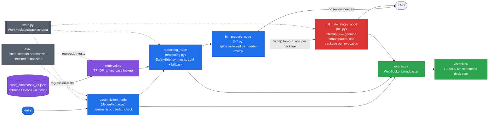

# Watchstander — Architecture

> **Status:** Living document. Update when a decision changes, a component is added/removed, or a migration phase completes.
> **Last updated:** 2026-08-08 — NAVSEA 8010 primary source pulled and verified; `MAX_CONCURRENT_HOT_WORKERS_PER_FIRE_WATCH` corrected from a conservative `1` to the manual's actual limit of `4` (ADR-023); previously same day: stale `hitl_gate_node` references corrected to the current `hitl_prepare_node` / `hitl_gate_single_node` shape and the idempotency fix (commit `ff91b3b`) documented (ADR-022); previously: 2026-07-31 — Research-First, Extraction-Aware policy adopted and first applied to both Extraction Candidates (ADR-020, ADR-021)

## 1. Purpose and Scope

Watchstander is a LangGraph-based multi-agent system that evaluates concurrent shipyard work packages for hazardous spatial/temporal overlap under **OSHA 1915 (Shipyard Employment)**, and gates anything flagged behind a genuine human-in-the-loop safety review. It exists to demonstrate deterministic, auditable safety reasoning grounded in real incident history — not a chatbot that talks about safety, a state machine that enforces it.

Out of scope for v1: Navy mishap data (classification/aggregation risk — deliberately excluded), any yard-specific proprietary data, and a full 3D digital twin (the spatial visualizer described in Section 8 is a 2D schematic, not a CAD-accurate model).

## 2. Design Principles

1. **Detection is deterministic, explanation is not.** `deconfliction.py`'s geometry/hazard-pair overlap check never touches an LLM — conflicts must be auditable and repeatable. The reasoning layer sits *after* that decision and only explains it; it cannot create or dismiss a conflict.
2. **Every generated brief carries its provenance.** A `SafetyBrief` is tagged `[SOURCE: LLM SYNTHESIS]` or `[SOURCE: DETERMINISTIC FALLBACK - LLM OFFLINE]`, both in its own text and as a top-level field — a reviewer must never have to guess whether a model actually reasoned about a conflict.
3. **The HITL gate blocks for real.** `hitl.py` uses LangGraph's `interrupt()` — execution genuinely pauses and waits for a decision, it does not simulate review with a stub.
4. **Grounded, never invented.** The reasoning node's system prompt and its deterministic fallback both work only from an explicit `_grounding_context()` dict assembled from already-verified state; case IDs, shipyards, dates, and outcomes are never invented.
5. **Edge-resilient by requirement.** Case retrieval (`retrieval.py`) uses a hand-rolled TF-IDF index instead of a vector DB specifically so deconfliction and citation keep working with zero network access and zero model-weight downloads — chosen over ChromaDB/FAISS + sentence-transformers for exactly that reason (see Decision Log).
6. **Public-domain case grounding only.** Every cited case in `case_data/` traces to a public OSHA/DOL record — no Navy mishap data, no proprietary yard data.
7. **Research-first, extraction-aware.** Before committing to a new subsystem, architectural pattern, or hard technical problem, do a lightweight sweep for whether the open-source/GitHub community has already solved this specific problem well — a habitual check at each genuinely new fork in the road, not a one-time ritual done at project kickoff. Default to adopting or adapting a solid existing solution rather than reinventing it; a known-good pattern from a past decision in this project is a reasonable starting hypothesis, not a permanent default, and gets re-checked when the problem's actual shape changes. When a real sweep turns up nothing solid, that's a finding, not a dead end — it's the signal to build the missing piece well and to ask whether what gets built is general enough to stand alone as its own public repo (see Extraction Candidates, Section 9). Log what was found (or that nothing solid existed) in the normal ADR entry for that decision. First adopted project-wide in SIMNAVY as ADR-007 there; adopted here as ADR-020.

## 3. Components

| Module | Responsibility |
|---|---|
| `state.py` | `WorkPackageState`, `SpatialCoordinates`, `HazardCategory`, `RiskLevel`, `SafetyBrief`, `HitlDisposition` — the schema everything else operates on |
| `deconfliction.py` | Deterministic spatial/temporal overlap detection between work packages — no LLM call |
| `rules_config.py` | Loads and schema-validates `case_data/hazard_rules_v1.json` into a `HazardRuleSet`; `deconfliction.py`'s `INCOMPATIBLE_HAZARD_PAIRS`/`MAX_CONCURRENT_HOT_WORKERS_PER_FIRE_WATCH` now source from it instead of being hand-typed constants (ADR-032) |
| `rules_audit.py` | Append-only JSONL audit trail (who/when/field/old/new/reason) for hazard-rule changes — a primitive for a future rule-editing tool to call, not a tool itself yet (ADR-032) |
| `case_lookup.py` | Phase 1 flat lookup: case citation by hazard category, first match in `case_data/cases_v1.json` |
| `retrieval.py` | Phase 3 TF-IDF ranked lookup: case citation ranked by similarity to the flagged conflict's own text, within the matching hazard category |
| `procedural_lookup.py` | Site-scoped governing-procedure lookup by `WorkPackageState.governing_installation` (e.g. NAVSEA 8010 for `"PSNS"`) — the applicable rule, distinct from case precedent; no installation set means no citation, not a silently-assumed default site |
| `reasoning.py` | Synthesizes a flagged conflict + its grounded case citation + its governing-procedure citation (if any) into a `SafetyBrief` for the human reviewer; live LLM call with a deterministic, zero-network fallback |
| `hitl.py` | `interrupt()`-based human review gate — the only place execution actually pauses. `hitl_prepare_node` splits reviewed-vs-needs-review; `hitl_gate_single_node` fans out one `interrupt()` per flagged package via `Send()` (see Section 5) |
| `reschedule_suggestion.py` | Decision-support only: given a flagged conflict, searches for the nearest whole-step schedule shift to one package that clears every conflict (pairwise + fire-watch capacity), re-using `deconfliction.py`'s exact deterministic checks. Never mutates state, never auto-applied, not yet wired into the graph or reviewer UI (ADR-030) |
| `graph.py` | Assembles `entry -> deconfliction -> reasoning -> hitl_prepare -> [hitl_gate_single x N, fanned out via Send()] -> END` |
| `case_data/cases_v1.json` | Sourced OSHA/DOL case histories, tagged by hazard category |
| `case_data/navsea_8010_psns_v2014.json` | Site-scoped (PSNS) governing-procedure citations sourced from the public-domain NAVSEA 8010 Manual, hot_work only — see Section 6 |
| `case_data/hazard_rules_v1.json` | Declarative hazard-pair and fire-watch-capacity rules, schema-validated by `rules_config.py` (ADR-032) |
| `visualizer/` | Godot 4 2D spatial scene rendering work packages, conflicts, and HITL state directly on top of real USCG ACUSHNET HAER drawings, not a schematic — two switchable views (Inboard Profile default, Deck Plan alternate) (Section 8, ADR-025, ADR-027) |
| `reviewer/` | Local FastAPI app reading real graph checkpoint state — the actual human-facing Approve/Reject interface, real `interrupt()`/`Command(resume=...)`, not simulated (Section 8.5) |
| `agent_core/demo_fixtures.py` | Real ACUSHNET-sourced `WorkPackageState` demo data, shared by `visualizer/demo_broadcaster.py` (flattened to raw event dicts) and `reviewer/` (run through the real graph) so both demo paths use identical data |
| `eval/` | Fixed-scenario evaluation harness measuring `deconfliction.py`/`retrieval.py`/`reasoning.py`'s deterministic-fallback path against a checked-in baseline (Section 7) |
| `eval/perf_benchmark.py` | Detection-latency benchmark, deliberately separate from `eval/run_eval.py` so wall-clock timing never touches the exact-match `baseline.json` regression gate — quotable numbers for `deconfliction.py`'s deterministic path at scale (ADR-033) |

*A larger, annotated version of this diagram with a legend and per-node explanations lives at [`docs/architecture-diagram.html`](https://cosmoagnostic.github.io/Watchstander/architecture-diagram.html) — open it directly in a browser.*

## 4. Reasoning and Grounding Model

Threat: an LLM inventing plausible-sounding but false case details (a fabricated shipyard, a fabricated fatality) in front of a Safety Officer making a real decision.

| Surface | Control |
|---|---|
| What the model sees | Only `_grounding_context()` — work package id, description, hazard categories, conflict rationale, and the single best-matching sourced case citation (or an explicit "no case on file" note) |
| What the model must return | Strict JSON with exactly three keys; any malformed or missing-key response is treated as a failure and falls through to the deterministic fallback, never partially trusted |
| No API key / no network | `_call_llm()` returns `None` immediately — this is the expected, always-true path in CI, not an error state |
| Provenance | Every brief is tagged at generation time (`provenance_tag()`), visible both in the brief's prose and as a standalone field in the HITL interrupt payload |

## 5. HITL Model

`hitl_prepare_node` partitions every work package into two groups: those that don't need review (passed straight through to `reviewed_packages`) and those flagged by `deconfliction.py` (`requires_hitl_review`) or independently marked `RiskLevel.CRITICAL`. `hitl_route` then fans the latter group out via LangGraph's `Send()`, one independent `hitl_gate_single_node` invocation per flagged package. Each invocation calls `interrupt()` with a payload built entirely from already-verified state: the work package id, description, hazard categories, conflict rationale, the safety brief (if one was generated) and its provenance tag, and risk level. The graph does not proceed past that package's gate until a human decision is resumed into it — but because each package gets its own checkpointed invocation, reviewers don't block each other and a crash mid-review only affects the one package being reviewed (see the fixed limitation below).

**The decision is now a structural fact on the state, not just prose.** An earlier version of this gate genuinely paused — that part was always real — but recorded the reviewer's answer only as a string appended to `conflict_rationale`; "approve" and "reject" produced identical `WorkPackageState` output, so a future consumer reading only structured fields (as opposed to grepping prose) couldn't tell them apart. This was flagged by an independent Fable-model code review. Fixed: `hitl_gate_single_node` now parses the raw decision via `_parse_decision()` into a `HitlDisposition` (`APPROVED` / `REJECTED` / `INVALID`, case-insensitive prefix match on "approve"/"reject") and sets two fields on `WorkPackageState` — `hitl_disposition` (the parsed verdict) and `cleared_for_execution` (`True` only when the disposition is `APPROVED`). An unparseable answer parses to `INVALID` and is treated identically to `REJECTED` — the gate fails closed on ambiguity rather than defaulting to open. `conflict_rationale` still gets the decision appended as human-readable prose, but `cleared_for_execution` is the field any future consumer (a scheduler, a permit issuer) must actually check.

**`cleared_for_execution` no longer defaults open while a review is pending (fixed 2026-07-25).** A second, more targeted Fable review pass — asked to line-trace `state.py`/`deconfliction.py`/`hitl.py` cold, not read this document — found the field's `True` default applied not just to packages that never needed review, but *also* to a package that needs review and hasn't gotten it yet: a `RiskLevel.CRITICAL` package reads as cleared from the moment it's constructed, and a flagged package reads as cleared from the moment `deconfliction_node` runs until its gate finishes. Any consumer trusting `cleared_for_execution` alone — exactly what its own docstring instructs — would treat an unreviewed conflict as cleared if it read state in that window, or if the graph crashed/terminated there. Fixed in two places: `WorkPackageState` gained a `model_validator` that forces `cleared_for_execution = False` at construction time for an unreviewed `CRITICAL` package; `deconfliction_node` now also sets it `False` the instant it flags a conflict, not just `requires_hitl_review = True`. The HITL gate remains the sole authority once an actual disposition is recorded — both fixes only tighten the *pending-review* default.

**`_parse_decision()` now checks for hedged/conditional language, not just a clean prefix (fixed 2026-07-25).** The same review found the prefix-only match wrongly parsed "approve only if the marine chemist re-certifies" and "approve?? absolutely not" as `APPROVED`, since both start with the literal substring "approve" — exactly the kind of ambiguous answer this parser exists to fail closed on. Fixed: a small set of negation/conditional cues ("not", "unless", "only if", "n't", etc.) is checked against the *leading* words of the answer before the prefix match runs; bounding the scan to the leading words (rather than the whole string) was itself a fix made mid-pass, after an early version wrongly flagged legitimate trailing rationale like "reject - the permit hasn't been signed off" as `INVALID` too.

**`conflict_rationale` now accumulates across multiple conflicts instead of being overwritten, and `find_all_conflicts` is idempotent (fixed 2026-07-25).** The same review found a package conflicting with two others only kept the *last* pair's rationale text (`.conflicts` stayed complete, the human-facing explanation didn't), and that re-running `find_all_conflicts` on the same objects — a retry, a checkpoint replay — appended duplicate entries and duplicate text with no guard at all. Fixed via `_record_conflict()`: an id is only appended to `.conflicts` if not already present, and rationale text is only appended to `.conflict_rationale` if it isn't already part of it.

**The overhead/underlying rationale label now tracks the actual overhead party, not argument position (fixed 2026-07-25).** `_vertically_stacked()` only confirms two packages differ on overhead status, not *which one* is overhead — the rationale text used to unconditionally name the first argument `a` as "Overhead work" regardless of which package actually carried `is_aloft`/`is_over_side`, wrong whenever the non-overhead package happened to be first (e.g. due to iteration order in `find_all_conflicts`). Fixed: `check_conflict()` now computes the actual overhead party explicitly. This is a distinct, narrower fix from the still-open `is_over_side`-treated-as-overhead semantic question below — this fix only corrects *which* package a correct-or-not label points at.

**`hitl_decided` no longer broadcasts the reviewer's raw free-text answer (fixed 2026-07-25).** The event used to include `decision=str(decision)` over the WebSocket, which violates `events.py`'s own stated policy of ids/flags/provenance-tags only, never raw content. Fixed: the event now carries the parsed `disposition` field only; the raw text remains available in `conflict_rationale` for anyone reading the state object directly, it's just off the wire.

**Non-idempotent multi-package HITL loop — fixed (2026-07-28, commit `ff91b3b`, ADR-022).** The gate used to be a single `hitl_gate_node` looping over every flagged package, calling `interrupt()` once per package inside that loop. LangGraph re-executes an interrupted node from the top on each resume, replaying earlier `interrupt()` calls from their cached resume values — so with two or more flagged packages in one invocation, resuming the second replayed the first package's entire path, including its `events.emit()` calls (the `conflict_rationale` append guard from the fix above masked the symptom but not the underlying replay). Fixed by restructuring the single looping node into three pieces: `hitl_prepare_node` partitions packages that need review from ones that don't; `hitl_route` fans the ones that do out via LangGraph's `Send()`, one independent node invocation per package; `hitl_gate_single_node` calls `interrupt()` exactly once, for exactly one package, per invocation. Each package now gets its own checkpointed invocation — resuming one never replays another's `events.emit()` calls, because there's no shared loop left to replay. Verified 67/67 three times (sandbox, Donnie's machine, post-rebase). This closes the last open Known Debt row from the original NEED list.

**Temporal deconfliction is now actually implemented (fixed 2026-07-27).** README and `deconfliction.py`'s own module docstring claimed spatial *and* temporal overlap detection since Phase 1, but `check_conflict()` never read `scheduled_start`/`scheduled_end` at all — two packages scheduled weeks apart in the same compartment were still flagged. Fixed via a new `_schedules_overlap()` helper, checked as an early gate in `check_conflict()` before either the hazard-pair or vertically-stacked branch runs: two packages are only flagged if they're both spatially *and* temporally linked. Missing schedule data on either side defaults to "temporally linked" (unknown treated as overlapping) — the opposite default from `_frame_ranges_overlap()`, which treats missing frame data as "no spatial link" — because a package with no schedule filled in yet cannot be assumed safe to run concurrently with anything, whereas a package with no location data yet genuinely can't be spatially linked to anything. Regression tests: `test_no_conflict_when_spatially_linked_but_scheduled_weeks_apart`, `test_conflict_still_flagged_when_schedules_actually_overlap`, `test_conflict_still_flagged_when_schedule_data_is_missing`.

**Event payloads now carry `schema_version` (fixed 2026-07-27).** Every broadcast event previously went out with no version marker — a future consumer (the visualizer, or a second non-Godot client) had no way to detect a breaking payload-shape change short of a runtime `KeyError`. Fixed: `agent_core/events.py` gained a module-level `SCHEMA_VERSION` constant and a pure `build_message()` function (split out of `EventBroadcaster.emit` so the JSON shape is unit-testable without a live WebSocket client) that stamps every message with it, placed after `**payload` so it always wins over an accidental caller-supplied key of the same name. cosmoai-adept's broadcaster (COSMOAGNOSTIC org, same design) does not yet have this field — worth porting there too, not done as part of this pass. Regression tests: `test_build_message_includes_schema_version`, `test_build_message_schema_version_wins_over_caller_supplied_key`.

## 6. Case Data Model

`case_data/cases_v1.json` is the only source of precedent the reasoning layer is allowed to cite. Each case is tagged by `hazard_category`, `shipyard`, `summary`, `root_cause`, and `osha_subpart`. Two lookup strategies exist side by side: `case_lookup.cite_case()` (Phase 1, flat first-match) is kept for its narrower test coverage and simplicity; `retrieval.cite_best_matching_case()` (Phase 3, TF-IDF ranked) is what `reasoning.py` actually calls in production once a hazard category has more than one candidate case. See MIGRATION.md Phase 4 for current case-count status per domain — this dataset is explicitly incomplete and tracked as open work, not finished coverage represented as if it were complete.

**Site-scoped governing-procedure grounding, added 2026-07-27.** Case data answers "what incident does this resemble"; it does not answer "what does the actual governing instruction require at this installation" — those are different questions, and conflating them would misrepresent precedent as regulation. `procedural_lookup.py` answers the second question, sourced from `case_data/navsea_8010_psns_v2014.json` (NAVSEA S0570-AC-CCM-010/8010, "Industrial Ship Safety Manual for Fire Prevention and Response," Distribution Statement A — public release, unlimited — dated 06 Feb 2014 / smoothed 26 Aug 2014). Deliberately site-scoped, not a universal Navy-wide ruleset: `WorkPackageState.governing_installation` (e.g. `"PSNS"`) selects which ruleset file applies, and a package with it unset gets no procedural citation at all, rather than one installation's rules being silently assumed to apply somewhere else (NASNI, NAVSTA Everett, SURFPAC vs AIRPAC vs AIRLANT all operate under different governing instructions). Adding a second site means adding a second sourced, versioned JSON file and a new entry in `procedural_lookup._RULESET_FILES` — not changing the lookup logic.

The 8010 Manual covers fire prevention/hot work only — it does not address confined_space, working_aloft, fall_protection, or over_the_side at all, so `navsea_8010_psns_v2014.json` has entries only for `hot_work` and none should be added for the other three categories under this source. `reasoning.py`'s grounding context carries the procedural citation alongside (not instead of) the case citation, and the system prompt instructs the model to keep the two distinguishable rather than blend precedent and regulation into one unlabeled claim.

**All seven entries in `navsea_8010_psns_v2014.json` verified against primary-source text (2026-08-08, ADR-023)** — previously every entry was marked `verified: false` (section titles and topical summaries extracted via automated document fetch, not confirmed verbatim against the primary-source PDF for exact numeric/procedural specifics). The primary-source PDF was pulled directly and Chapters 4 and 11 read in full; each entry's summary was checked against the actual section text and corrected where the original automated-extraction phrasing was imprecise (`NAVSEA8010-4.4.3`'s exact numeric limit, `4.4.4`/`4.4.6`'s framing, `11.1.7`'s hangar-door specifics — see the file's own `verification_note` for what changed per entry). `cite_governing_procedure()` still surfaces an explicit `[UNVERIFIED: ...]` caveat whenever an entry's `verified` field is `false` — the mechanism itself is unchanged and covered by its own test (`test_cite_governing_procedure_surfaces_unverified_caveat_when_entry_says_so`, decoupled from this file's real content on purpose) — it's just that no current entry triggers it anymore. A future entry added to this file starts at `verified: false` again; verification is earned per-entry, not inherited by the file as a whole.

**Fire-watch capacity (NAVSEA8010-4.4.3), added 2026-07-27, limit corrected 2026-08-08 (ADR-023).** "Limitations to Single Fire Watch with Multiple Hot Workers" is a genuinely new deconfliction concept, not a variant of the existing spatial/hazard-pair checks: it's an N-way capacity constraint (how many concurrent hot-work packages one fire watch covers), not a pairwise geometry check, so it lives in its own function, `deconfliction._fire_watch_capacity_conflicts()`, called separately from the pairwise `check_conflict()` loop inside `find_all_conflicts()`. `WorkPackageState` gained `fire_watch_id` — packages sharing a non-null `fire_watch_id`, both `HOT_WORK`, with overlapping schedules (via the same `_schedules_overlap()` used elsewhere), are flagged once the group exceeds `MAX_CONCURRENT_HOT_WORKERS_PER_FIRE_WATCH`. That constant was originally set to `1` as a conservative placeholder — the exact numeric limit in NAVSEA8010-4.4.3 was unverified against primary-source text. It's now `4`, the manual's actual stated limit ("No more than four hot workers shall be attended by a single fire watch," Chapter 4.4.3), read directly off the primary source rather than left artificially conservative. Packages with no `fire_watch_id` set are never grouped together, since silently assuming two unrelated packages share a fire watch would fabricate a capacity conflict that was never actually claimed. A separate, real gap in this function's size-gate logic was found while updating its tests for this change — see Known Debt.

## 7. Test Strategy

Deterministic logic (`deconfliction.py`, `case_lookup.py`, `retrieval.py`) is tested directly with no mocking required — same inputs, same outputs, every time. `reasoning.py` is tested exclusively through its deterministic fallback path (no `ANTHROPIC_API_KEY` in CI), which is the actual guarantee this project makes: the system produces a real, case-grounded, provenance-tagged brief with zero API keys and zero network calls, not just when the LLM path happens to work.

**`graph.py` and `hitl.py` are now tested too — they weren't before.** An independent Fable-model review found that no test in this repo ever imported `agent_core.graph` or `agent_core.hitl`, and that `graph.py` failed to import at all on a clean install (`langgraph.checkpoint.sqlite.SqliteSaver` comes from a separate package that wasn't declared in `pyproject.toml`) — CI was green while the flagship assembled graph was unrunnable. `tests/test_graph.py` now builds the real graph via `build_graph()` and drives a full `entry -> deconfliction -> reasoning -> hitl_prepare -> hitl_gate_single -> END` invocation through a genuine `interrupt()`/`Command(resume=...)` cycle using `MemorySaver` — this is the regression test for that gap. `tests/test_hitl.py` separately exercises the disposition-parsing fix in Section 5 (approve/reject/ambiguous/no-review-needed/critical-risk cases) through the same real-graph mechanism, not a stub.

**Evaluation harness (`eval/`, added 2026-07-25).** Unit tests answer "does this one function behave correctly on this one input"; they don't answer "out of a representative set of real-world-shaped scenarios, how many does the whole pipeline get right, and which specific ones does it still get wrong." `eval/scenarios.py` is a fixed, hand-authored, checked-in suite — 14 conflict-detection scenarios and 7 case-retrieval scenarios (the latter against the real `case_data/cases_v1.json`, not synthetic data) — each one built from a concrete real-world shape, not sampled or generated. Crucially, several scenarios are *known gaps on purpose*: `gap-adjacent-frames-not-touching`, `gap-two-aloft-packages-stacked`, and `gap-simultaneous-confined-space-entries` each reproduce a specific false negative already named in Section 9's Known Debt table, and `debatable-aloft-fall-protection-compliant-config` reproduces the domain-questionable `{WORKING_ALOFT, FALL_PROTECTION}` hazard pair Fable flagged as possibly flagging a compliant configuration. `eval/run_eval.py` runs the real, non-mocked pipeline against every scenario (zero API keys, zero network calls — same constraint as the rest of the suite) and produces a metrics dict; `eval/baseline.json` is that dict from the last reviewed run, checked into git; `tests/test_eval_harness.py` fails if a fresh run doesn't match the baseline byte-for-byte, and separately fails if the set of known-gap scenario IDs ever changes — whether a gap silently regresses in or a gap gets fixed and nobody updates the baseline. The intent, consistent with this project's documentation culture: turn "a reviewer noticed this reading code" into "CI measures this and reports the exact number on every run," rather than letting qualitative findings decay back into undocumented tribal knowledge once the review that found them is over.

## 8. Digital Twin / Spatial Visualizer (Phase 5)

**Status: built and substantially complete — see MIGRATION.md Phase 5.** This section originally recorded the design before the visualizer existed; that status line went stale once Phase 5 shipped and was caught by an external review pass rather than updated proactively (the project's own Maintenance Rules say "if the doc and the code disagree, the doc is the bug"). The one remaining open item is a standalone JSON spatial-payload export (distinct from the live WebSocket stream) — everything else described below is implemented, screenshot-verified, and covered by `tests/test_events.py`.

Unlike cosmoai-adept's visualizer — an agent walking between abstract tool stations — Watchstander's natural visualization is literally spatial: work packages already carry `compartment_id`, `frame_start`/`frame_end`, and `deck_level`. The visualizer renders these as an actual schematic cross-section rather than an abstraction layered on top of unrelated data.

**Telemetry layer.** `agent_core/events.py` (new) mirrors cosmoai-adept's design exactly: a lazy-started, no-op-by-default WebSocket broadcaster. `graph.py`'s nodes emit `deconfliction_start`/`deconfliction_result`, `reasoning_start`/`reasoning_result`, and `hitl_awaiting`/`hitl_decided` at the same points execution actually reaches them — never full work-package descriptions or case text, only ids, hazard categories, conflict flags, and the safety-brief provenance tag, consistent with the "operational metadata, not raw content" rule already used in the COSMO projects.

**Scene layout.** A top-down shipyard cross-section: frame numbers run left-to-right as a labeled grid axis, deck levels stack top-to-bottom as horizontal bands, compartments render as labeled rectangles positioned by their `frame_start`/`frame_end` and `deck_level`. Work packages appear as markers inside their compartment's cell — aloft/over-side work floats above the deck band it's staged from, matching `deconfliction.py`'s own `_vertically_stacked()` check. When `deconfliction_result` flags a conflict, both work packages' markers and the connecting overlap region render in a hazard color; when `hitl_awaiting` fires, the flagged package's marker pulses and a HUD panel shows the safety brief text and its provenance tag until `hitl_decided` resolves it.

**Asset sourcing decision (superseded by ADR-025 below).** Real ship general-arrangement drawings (DWG/DXF) exist but are commercial CAD marketplace content with unclear reuse licensing, and Godot 4 has no native 2D CAD import path (only STL, which is 3D-print geometry). At the time this decision was made (ADR-006), no real, license-clean, importable drawing was in hand, so the deck plan was generated procedurally instead — grid lines, deck bands, and compartment rectangles, with the `gen_assets.py` + PIL pattern already used for both COSMO visualizers. That constraint stopped applying once the ACUSHNET HAER sheet was sourced for the 3D blockout (ADR-019) — a real, public-domain, license-clean drawing existed the whole time this section's original reasoning assumed didn't. See ADR-025.

**Consistency with the established house rule:** speech-bubble-equivalent text (the safety brief panel) must hold long enough to read — same `clamp(text.length() / CHARS_PER_SECOND, MIN, MAX)` timing rule as both existing visualizers, not a fixed duration.

**3D blockout companion view (2026-07-28, ADR-019).** A second, static, non-networked scene (`visualizer/Main3D.tscn`) renders the demo vessel — USCG Cutter ACUSHNET / ex-USS SHACKLE (ARS-9), sourced in `docs/uscg-acushnet-ars9-source.md` — as a simplified 3D hull with compartments extruded at their real frame positions. This does not supersede the 2D live view above; `Main.tscn` is still the only scene wired to `agent_core.events`. The 3D scene exists because a real drawing with printed frame numbers made a "greybox"-style blockout (straight hull, real compartment positions, no traced curvature) tractable in the same spirit as this section's own ADR-006 — get the real spatial data right, simplify the geometry deliberately and say so, rather than either importing licensed CAD or claiming false precision. Verified by an actual headless render (Godot 4.3 + Xvfb + software GL) during development, not just written and assumed to work.

**Real HAER print as the 2D background, not a generated schematic (2026-08-08, ADR-025).** After watching the schematic 2D visualizer run live for the first time, Donnie asked directly to see the actual drawings instead of an abstraction of them — 2D or 3D, whichever was faster to deliver, "just looking for the best design decision for right now." `Main.gd`'s background swapped from the generated `bg_blueprint.png` to `bg_acushnet_deckplan.png`, a real capture of the Library of Congress's own copy of HAER AK-49 Sheet 5/10 ("Deck Plans" — Main Deck and Second Deck, with the sheet's own printed frame scale). Sourcing method: this sandbox's own network egress is allowlisted and blocks tile.loc.gov directly (same class of restriction documented for Hugging Face and osha.gov elsewhere in this project's history) — worked around by navigating to the image URL in a live, user-connected Chrome browser session (same technique ADR-007's OSHA sourcing used for verbatim text, applied here to an image instead) and capturing a screenshot, then cropping out the browser chrome in Python/PIL. This is a screen capture of the real drawing, not the raw master TIFF — acceptable for a background texture at the visualizer's display size, and disclosed as such rather than presented as a pixel-perfect archival copy.

Frame-to-pixel and deck-to-pixel calibration (`Main.gd`'s `FRAME_MIN`/`FRAME_MAX`/`X_MIN`/`X_MAX`/`BAND_*` constants) was measured directly off this specific image — the sheet's own printed 0-220 ft scale bar and the vertical position of each deck row — to the same "approximately right, not survey-accurate" precision bar `docs/uscg-acushnet-ars9-source.md` already sets for reading frame ranges off this same drawing (±2-3 frames). One real, disclosed consequence: the real print has the bow on the right and the stern on the left (the "FWD" label sits at the right edge of both deck rows) — the opposite of the old procedural schematic's left-to-right-increasing-frame convention (Section 8's "Scene layout" paragraph above, now describing the superseded version). Mirroring the image to preserve the old axis direction would have mirrored its printed text (ship name, deck labels, frame scale numbers) into unreadable backwards text — judged a worse trade than simply reversing which constant (`X_MIN`/`X_MAX`) maps to which frame extreme, which `_frame_to_x()`'s existing linear interpolation already handles correctly with no formula change. `ALOFT`/`3RD_DECK`/`OVER_SIDE` bands have no literal row on this two-deck sheet (it only shows Main Deck and Second Deck) and stay placed in the image's margins, same approximate-by-nature status they already had against the procedural schematic.

Not verified against an actual Godot render this session — no Godot installed in the build sandbox, unlike ADR-019's 3D blockout work, which had one. Verified instead with a Python/PIL mockup reproducing `Main.gd`'s exact calibration constants against the real background image and the real ACUSHNET demo fixture data, confirming markers land in domain-plausible positions (the fall-protection package near the bow, matching its real Anchor Windlass Room compartment) before shipping — a real substitute check, not skipped, but a lower bar than an actual in-engine screenshot. **Update, same day (ADR-027/ADR-028):** Donnie confirmed this live in his own Godot editor once ADR-026's connectivity fix landed — the mockup's predicted marker positions matched the real render on both views, closing this specific gap.

**WebSocket connectivity fix — "localhost" is a hostname, not an address (2026-08-08, ADR-026).** When Donnie actually ran the ADR-025 build on his own Windows machine, the visualizer connected to nothing — no error, no data, the scene just sat static. Root cause: `agent_core/events.py`'s server and `Main.gd`'s client both connected to the hostname `"localhost"`. On a dual-stack machine (Windows in particular) that hostname can resolve to a different address family on each side (IPv6 `::1` vs IPv4 `127.0.0.1`) depending on resolver order — both sockets open successfully, neither throws, and no data ever crosses, which is indistinguishable from "nothing is happening yet" without a live connection indicator to check. Fixed by pinning both sides to the literal loopback address `127.0.0.1`. A second, compounding problem made this bug invisible for longer than it needed to be: the HUD's status line was static text (`"ws://localhost:8081"`), not a real indicator — it never reflected whether a connection had actually been made. `Main.gd` now tracks connection state live and shows it (orange "not connected -- retrying" / green "connected"), so a future instance of this same class of bug — server up, client up, nothing crossing — is visible as "not connected" instead of looking identical to no problem at all. Regression test: `tests/test_events.py::test_default_host_is_the_literal_loopback_address_not_a_hostname`.

**Inboard Profile as the default 2D view, Deck Plan as a switchable second view (2026-08-08, ADR-027).** ADR-025's Deck Plan background rendered correctly but was the wrong *type* of drawing for what the scene was already doing: a HAER "Deck Plan" sheet is a top-down floor plan, and `Main.gd`'s ALOFT/MAIN DECK/2ND DECK/HOLD/WATERLINE band scheme is a side cross-section metaphor — only two of the five bands (Main Deck, 2nd Deck) had any corresponding row on that sheet at all. Donnie caught this directly, watching it run: "you gave a top down drawing, the animation underneath is still the original we've been looking at for weeks — it visually has nothing to do with the drawing." The fix was to source the correct sheet type rather than patch band positions onto the wrong one: HAER AK-49 Sheet 3/10, "Inboard Profile," is a real side cross-section of ACUSHNET with compartments stacked by actual deck height and the same printed frame scale convention as Sheet 5 — every one of this scene's five bands corresponds to a real row on this sheet. It's now the default background. Sourced the same way as ADR-025 (live user-connected Chrome browser session, this sandbox's own network blocks `tile.loc.gov` directly), calibrated independently against its own pixel geometry (different image, different scale — not the same constants reused), and cross-checked against `docs/uscg-acushnet-ars9-source.md`'s already-known compartment identities (Lazarette lands aft-most, Forepeak Tank lands forward-most, matching their real names) rather than relying on tick-mark reading alone, since this image's native resolution makes the smallest printed frame numbers illegible.

Rather than discard the Deck Plan sheet now that it's not the default, Donnie asked for the ability to cross-reference a flagged conflict against more than one real angle of the ship — so both sheets ship, switchable at runtime with the **V key** (`Main.gd`'s `VIEWS` array, `_toggle_view()`). Each view carries its own independent calibration (frame-to-pixel and deck-to-pixel constants, background position/size, band-label positions, Safety Review station position); toggling re-lays-out whatever data was last received (`last_work_packages`/`last_conflicts`/`hitl_awaiting_id`) against the newly active view rather than resetting the scene, so switching mid-review doesn't lose state. Same verification limitation as ADR-025: checked with a Python/PIL mockup reproducing `Main.gd`'s exact per-view constants against the real ACUSHNET demo fixture data for both views (all four demo packages land in geographically plausible positions on both sheets — FALL-2204 at the bow/Anchor Windlass Room on both), not an actual Godot render.

**Marker rendering: colorblind-safe palette and a crisp pin, not a blurred glow (2026-08-08, ADR-028).** The first time markers actually rendered live against the real print (once ADR-026's connectivity fix landed), the result was reported directly: "it looks like a colored smudge... the color palette is wrong and hard to see on a white background... make the pinpoints not look like an ink smudge." Both problems traced to the same root cause — `HAZARD_COLOR`'s pastel palette and `gen_assets.py`'s `glow_sprite()` (a Gaussian-blurred soft dot) were tuned against the dark procedural schematic background (ADR-006) and never re-tuned when that background became a real white/cream drawing (ADR-025); a design assumption that quietly stopped holding once the thing under it changed. Fixed with two changes: `HAZARD_COLOR`/`DEFAULT_MARKER_COLOR`/`CONFLICT_COLOR` switched to the Okabe-Ito colorblind-safe qualitative palette (Okabe & Ito, 2008 — the standard reference palette for figures that must stay distinguishable under the common forms of color vision deficiency), chosen over an arbitrary "looks better" repaint because it's a known-good, citable standard rather than another guess; and a new `marker_pin()` asset (`gen_assets.py`) — a crisp, opaque white-fill/dark-outline circle, tinted via `modulate` at runtime — replacing `glow_sprite()` for both work-package markers and the Safety Review station. Marker labels also switched from hazard-colored text to fixed dark text with a white outline, since some Okabe-Ito hues read poorly as small text against white paper even though they're fine as filled dots.

## 8.5 Real HITL Reviewer Web App (`reviewer/`)

**Status: built, tested against the real graph, not yet given auth or a real intake form — see MIGRATION.md Phase 7.**

The visualizer (Section 8) is a status view: it shows *that* a package is
flagged and waiting, deliberately never *why* (events.py's broadcast policy).
Until this landed, nothing in the repo let an actual human read a flagged
package's full brief and make a real decision — the only things that ever
answered a real `interrupt()` were the test suite (hardcoding `"approve"`)
and `demo_broadcaster.py` (which fakes the whole event sequence and never
touches the real graph at all). `reviewer/` closes that gap: a small local
FastAPI app that runs the real `build_graph()`, persists real `interrupt()`
state across HTTP requests via a real `SqliteSaver` (not `MemorySaver`,
which every existing test uses and which would lose all pending reviews on
process restart), and gives a human a page showing the full description,
conflict rationale, synthesized safety brief, and its provenance tag (LLM
vs. deterministic fallback) — with a real Approve/Reject form whose submit
calls `graph.invoke(Command(resume={interrupt_id: decision_text}), ...)`,
genuinely resuming the paused graph.

**Why a separate channel instead of loosening `events.py`'s broadcast
policy.** The policy (Section 8, ADR-013) exists because the visualizer's
WebSocket is a public, unauthenticated broadcast — anything emitted there
is available to any listener on the port, by design (it's meant to drive a
demo screen, not gate access to sensitive content). The reviewer app's data
(descriptions, conflict rationale, full safety briefs) is exactly the
content that policy exists to keep off that channel. Rather than add a flag
to selectively broadcast more, `reviewer/` reads this data directly from the
graph's own checkpointed state (`graph.get_state()`), which was already
there — no new broadcast, no policy exception, no risk of a future listener
on 8081 accidentally getting content it was never supposed to see.

**A real bug found by testing the actual approve flow, not by inspection.**
`state.tasks[i].interrupts` keeps listing a Send()-fanned-out task's
original `Interrupt` object even after that task has been resumed and
completed — only `task.result` being non-`None` actually distinguishes
"done" from "still genuinely paused." The first version of
`list_pending_reviews()` didn't check this, so an approved package never
left the pending queue in the dashboard, only in the underlying graph state.
Caught by `tests/test_reviewer.py::test_approving_one_package_leaves_the_others_pending`
actually running the approve flow end-to-end through the FastAPI
`TestClient`, not by reading the code. Fixed by skipping any task where
`task.result is not None` before reading its `.interrupts`.

**Partial resume, verified directly.** `hitl.py`'s one-`interrupt()`-per-
package design (ADR-022) is what makes this app's per-package review UX
possible at all: `Command(resume={one_interrupt_id: decision})` resolves
only that package, leaving every other pending interrupt on the same or a
different thread untouched — confirmed with a direct debugging script
before building the UI around the assumption, then re-confirmed by
`test_approving_one_package_leaves_the_others_pending`.

**Data source: shared, not duplicated.** `agent_core/demo_fixtures.py`
(new) holds the real ACUSHNET compartment/frame data as actual
`WorkPackageState` objects, meant to be run through the real graph.
`visualizer/demo_broadcaster.py`'s scripted event-payload dicts are now
derived from this same source at import time rather than hand-duplicated —
the two demo paths (scripted visualizer event replay vs. real reviewer
graph run) can no longer quietly drift onto different compartment/frame
values.

**Known debt, disclosed not hidden:** no auth (fine for one local reviewer
on their own machine, the same trust boundary the visualizer's undefended
WebSocket already assumes — not safe to expose beyond localhost); no real
work-package intake form yet, only "seed the ACUSHNET demo"; no live-
updating dashboard (refresh to see new state, unlike the visualizer's
WebSocket push); `langgraph`'s own msgpack serializer emits a deprecation
warning about unregistered types (`WorkPackageState`, `RiskLevel`,
`HitlDisposition`, `HazardCategory`) on every checkpoint read/write — not
yet registered via `allowed_msgpack_modules`, which a future `langgraph`
version will require rather than warn about.

## 9. Known Debt

| Item | Notes |
|---|---|
| Case data incomplete | MIGRATION.md Phase 4 — not yet at 5-10 cases per core hazard domain; `confined_space` and `fall_protection` specifically need more sourcing passes |
| Single reasoning provider | `_call_llm()` only supports Anthropic; no local-backend option yet (cosmoai-adept has one — worth porting here once the visualizer work lands, not decided yet) |
| No adjacency tolerance on frame ranges | `_frame_ranges_overlap()` only catches genuine intersection — hot work one frame away from an uncleared confined space (the exact "adjacent uncleared space" scenario `INCOMPATIBLE_HAZARD_PAIRS`'s own comment cites) isn't flagged. A `±N`-frame tolerance would close this. Quantified as `eval/scenarios.py`'s `gap-adjacent-frames-not-touching` |
| `deck_level` collected, never used | Two aloft crews stacked on the same frame range at different deck levels return no conflict (`a_overhead == b_overhead` is `True == True`); same-category pairs generally can't trigger `INCOMPATIBLE_HAZARD_PAIRS` at all. Quantified as `eval/scenarios.py`'s `gap-two-aloft-packages-stacked` and `gap-simultaneous-confined-space-entries` |
| `is_over_side` semantically modeled as "overhead" (accepted, not planned) | The conflict is still correctly (conservatively) flagged, and the rationale names the correct *package* as overhead (fixed 2026-07-25 — see Section 5) — the underlying model treats over-the-side work as the "overhead" party the same as aloft work, which is domain-backwards (over-the-side hangs below the deck edge). This is a labeling-precision gap, not a safety gap: it never causes an under-flag, only an occasionally imprecisely-worded rationale on an already-correctly-flagged conflict. Deliberately deprioritized (2026-07-27, ADR-016) rather than left as ambiguously "open" — see ADR-016 |
| `{WORKING_ALOFT, FALL_PROTECTION}` hazard pair may flag a compliant configuration | Working aloft *requires* fall protection under 29 CFR 1915.159/.77 — a fall-protection package near aloft work may just mean the rule is being followed, not violated. Quantified as `eval/scenarios.py`'s `debatable-aloft-fall-protection-compliant-config` |
| No dependency version pinning | `pyproject.toml` has no version bounds beyond `>=` floors and there's no lockfile |
| Governing-procedure ruleset is single-site (PSNS) by design, not yet multi-site | `procedural_lookup._RULESET_FILES` has one entry. Adding a second installation (NASNI, NAVSTA Everett, SURFPAC vs AIRPAC vs AIRLANT, etc.) is architecturally supported (add a sourced JSON file + a dict entry) but not yet done — no second site's rules exist in this repo yet, and none should be assumed |
| `_fire_watch_capacity_conflicts()`'s size gate uses raw per-fire-watch package count, not per-time-window concurrency | Discovered 2026-08-08 while updating the fire-watch capacity tests for ADR-023's limit change. The function groups all packages sharing a `fire_watch_id` and short-circuits (`continue`, no violation) only if that *total* count is `<= MAX_CONCURRENT_HOT_WORKERS_PER_FIRE_WATCH` — but if the total exceeds the limit only because packages are spread across genuinely non-overlapping time windows (e.g. 3 packages on one fire watch in week 1, 2 more on the same fire watch in week 3 — 5 total, but never more than 3 concurrently active), the pairwise loop still runs and flags every temporally-overlapping pair within the inflated group, even though no more than 3 were ever simultaneously covered by that fire watch at any instant. Not a safety gap in the over-flagging direction the rest of this module favors — it's an *over*-flagging bug, not an under-flagging one, so it's lower priority than most rows in this table, but it is a real false-positive path. Would need the size check to run per maximal temporally-overlapping cluster within a `fire_watch_id` group, not on the group's raw total. Not fixed this pass — flagged, not silently worked around; the regression test covering the correct "spread across non-overlapping windows" case was deliberately designed to avoid triggering this gap rather than paper over it (see `test_fire_watch_capacity_not_flagged_when_schedules_dont_overlap`'s docstring) |
| `reviewer/` has no auth, no real intake form, and no live-updating dashboard | See Section 8.5. Acceptable for one local reviewer on their own machine; not safe to expose beyond localhost as-is |
| `langgraph`'s msgpack serializer warns on every reviewer checkpoint read/write | `WorkPackageState`, `RiskLevel`, `HitlDisposition`, `HazardCategory` are "unregistered types" per `langgraph.checkpoint.serde.jsonplus` — currently a deprecation warning, will become a hard block (`LANGGRAPH_STRICT_MSGPACK=true`) in a future `langgraph` version. Fix is to register them via `allowed_msgpack_modules`; not done yet since it's still just a warning |
| Deck Plan view's ALOFT/STAGING band placement reads oddly on that sheet's top-down layout | Both views share the same margin-position convention for bands with no real row on the sheet (inherited from ADR-025/ADR-027) — correct reasoning for the Inboard Profile's side-view "aloft is up" framing, but a top-down plan has no "up" for aloft work to correspond to. Reported directly by Donnie, explicitly deferred, not fixed this pass — see MIGRATION.md Phase 9 |
| No `CONDITIONALLY_APPROVED` disposition — a genuinely conditional approval ("approved once X is confirmed") has no representation | ADR-029 deliberately kept `HitlDisposition` binary (APPROVED/REJECTED, plus fail-closed INVALID) to ship the structured-decision fix without also designing a resolution workflow. A reviewer who means to attach a real condition must REJECT today and have the package resubmitted once the condition is actually met; a `note` recorded alongside a decision is audit trail only and is never enforced. `CONDITIONALLY_APPROVED` is the reserved name for the future third state (see `HitlDisposition`'s docstring) — do not introduce a different name or a separate bool flag for this concept later. Adding the enum value itself will be cheap: `cleared_for_execution`'s allowlist check (`disposition == HitlDisposition.APPROVED`) already defaults to `False` for any non-APPROVED value, so a new value needs no change there. The real remaining cost is undesigned: a resolution mechanism (what actually flips a conditionally-approved package to cleared once its condition is met — a second review pass, an automated check, an external callback) and the reviewer UI to drive it |
| `reschedule_suggestion.py` isn't wired into the graph, `SafetyBrief`, or the reviewer UI | ADR-030 built the search function and its regression tests deliberately standalone. A reviewer today has no way to see a suggestion without calling `suggest_reschedule()` directly in a shell. Two real integration points identified, neither started: (1) `reasoning_node` could attach a suggestion to `SafetyBrief.recommended_action` when one exists; (2) `reviewer/app.py` could surface it as a one-click "apply this shift and resubmit" affordance next to Approve/Reject. Both are additive — no existing behavior changes either way |
| `reschedule_suggestion.py` only ever shifts one package | No joint multi-package resequencing (moving two packages to accommodate each other) yet. If a genuine need for joint resequencing shows up, this is the point where OR-Tools CP-SAT (already flagged in Section 9's Extraction Candidates table for the harder chit-expiration problem) becomes worth evaluating for this problem too — not before |
| `_fire_watch_capacity_conflicts()` reused inside `suggest_reschedule()`'s search loop has cubic cost in fire-watch group size | Independent Opus review (AOSE Round 6, 2026-08-21) measured it directly: that function was built for one-time reporting (formats a full rationale string per violating pair) and `suggest_reschedule()` calls it once per candidate offset, discarding the string every time. Measured: 74 seconds at 50 packages on one fire watch, ~72 minutes at 200. The underlying concurrency check (`_fire_watch_peak_concurrency()`) is O(M log M) and fast on its own — the cost is entirely in reporting machinery the search never uses. Not fixed this pass; real before this module is demoed against any hot-work-heavy scenario |
| `suggest_reschedule()`'s "nearest offset wins" objective has no shift, calendar, or direction awareness | Independent Opus review: minimizing `|shift|` alone can recommend landing hot work at 0200, or moving a start date earlier when later is almost always easier operationally (material staging, tag-outs, manning) — and reproducibly returned shifts of nearly 2 days earlier in test runs. `state.py` has no shift/working-hours model and no movable/fixed flag, so this isn't a quick fix — it's a modeling gap the objective can't see past |
| `suggest_reschedule()` converts every existing `deconfliction.py` false negative into an active recommendation, not just a missed flag | Independent Opus review: e.g. `_vertically_stacked()`'s known gap (two aloft packages on the same frame range never conflict, per §9's Known Debt / `eval/scenarios.py`'s `gap-two-aloft-packages-stacked`) means the search can and will actively suggest a slot that puts a package into simultaneity with another aloft crew, not just fail to flag it after the fact. A recommendation carries more implied authority than a silence does — every detector gap in this table got more severe the moment this module shipped, and that wasn't stated in ADR-030 |
| `suggest_reschedule()`'s docstring said a missing `target_id` returns `None`; the code raises `ValueError` | Independent Fable cross-review (AUD-12, AOSE Round 6). The `ValueError` is the intended, tested behavior (`test_raises_when_target_id_not_present`) — the docstring was wrong, per this doc's own Maintenance Rule ("if the doc and the code disagree, the doc is the bug"). Not yet corrected in the source |
| `HazardRuleSet` doesn't reject an unrecognized `schema_version` or unknown extra JSON keys | Independent Fable cross-review (AUD-13). A file stamped `schema_version: 999`, or carrying typo'd/extra fields, loads without complaint under pydantic's default `extra='ignore'` — the one malformed-input class "fails loudly at import time" (rules_config.py's own docstring claim) doesn't actually cover. `max_concurrent_hot_workers_per_fire_watch` also has no ceiling (`ge=1` only) |
| `rules_audit.py`'s `read_audit_log()` raises on one truncated trailing line, making every prior valid entry unreadable | Independent Fable cross-review (AUD-14), reproduced by appending a deliberately truncated line and calling the reader. A crash mid-append (real failure mode for an append-only log with no fsync/atomicity guarantee) doesn't just lose the one partial entry, it blocks reading everything before it through the only read API. "Append-only" is also enforced only by convention (Fable's AUD-15) — nothing stops out-of-band truncation |
| `eval/perf_benchmark.py`'s synthetic-data docstring claims a conflict count that is "neither 0 nor n·(n-1)/2" at every scale | Independent Fable cross-review (AUD-16). False at n=10, the first row of the default benchmark — 0 packages flagged, so that row only exercises the fast-exit path the docstring says it avoids. Larger rows (n>=50) are fine |
| Fire-watch capacity branch of `suggest_reschedule()` had zero test coverage before AOSE Round 6 | Independent Fable cross-review (AUD-19) — direct cause of AUD-10 (see ADR-034) shipping undetected. Two regression tests added closing this specific gap; broader coverage of the search function's edge cases (duplicate `work_package_id`s, non-positive `step`) remains open (AUD-17, AUD-18, Fable, unverified severity) |
| `rules_audit.py` isn't called by anything yet | No rule-editing GUI exists yet, so nothing invokes `record_rule_change()` in normal operation today. A manual, deliberate edit to `case_data/hazard_rules_v1.json` (e.g. a future ADR changing the fire-watch limit) is expected to call it by hand until an editing tool exists — not enforced by code yet |

### Extraction Candidates

Not everything below gets extracted — this is a candidates list, not a commitment. It's where "should this become its own public repo" judgment calls start, per Design Principle 7, instead of being made ad hoc or forgotten.

| Item | Why it's a candidate | Status |
|---|---|---|
| Temporal chit-expiration / multi-clock deconfliction engine (see `claude/watchstander-deconfliction-integration.md`) | Constraint-satisfaction problem (independent-clock expiration flags before shift start) that isn't carrier- or Navy-specific in shape — any industrial site with overlapping time-boxed permits has the same problem. Research sweep (2026-07-31, see ADR-021) found no existing open-source solution for this specific problem shape — genuine gap, not reinvention | Sweep done, gap confirmed — still architecture/requirements-capture only, no real data access yet. OR-Tools CP-SAT flagged as the candidate constraint-modeling substrate to evaluate before hand-rolling a solver |
| `eval/` fixed-scenario harness pattern (baseline.json + known-gap scenarios as regression tests) | Generalizes past this repo's domain — the pattern of "checked-in baseline + scenarios that deliberately encode known gaps as first-class regression tests" is a reusable eval-harness idea, not Watchstander-specific | Sweep done (2026-07-31, see ADR-021) — this is "golden-file testing," an established, already-widely-implemented pattern, not a novel gap. Downgraded: not a standalone-repo candidate. The one original piece (asserting the known-gap scenario ID set itself hasn't silently drifted) may be worth a short writeup, not extraction |

## 10. Decision Log

| ID | Date | Decision | Rationale |
|---|---|---|---|
| ADR-001 | 2026-07-23 | Deterministic geometry/hazard-pair check, LLM layered on top only for explanation | Conflict detection must be auditable and repeatable; an LLM deciding whether a hazard exists is unacceptable in a safety-critical gate |
| ADR-002 | 2026-07-23 | Real LangGraph `interrupt()` for HITL, not a simulated review step | The whole point of the gate is that it actually blocks; a fake gate is worse than no gate because it looks safe |
| ADR-003 | 2026-07-24 | Explicit provenance tagging on every `SafetyBrief` | A reviewer must always be able to tell model-generated from templated output — silent equivalence between the two paths was flagged as unacceptable in architecture review |
| ADR-004 | 2026-07-24 | Pure-Python TF-IDF retrieval instead of a vector DB | Edge-resilience requirement rules out runtime model-weight downloads; corpus size (low tens of docs) doesn't justify the dependency anyway |
| ADR-005 | 2026-07-24 | `over_the_side` dropped as a standalone case-citation category, kept as a spatial flag | Civilian OSHA (29 CFR 1915) captures over-water fall hazards under Fall Protection (Subpart I); standalone tracking is a Naval/NSTM convention, not a civilian OSHA case pattern |
| ADR-006 | 2026-07-25 | Procedural schematic deck plan instead of real ship CAD drawings for the visualizer | Real ship general-arrangement drawings are commercial CAD content with unclear reuse licensing, and Godot 4 has no native 2D CAD import path; a generated schematic is license-clean and consistent with the existing asset pipeline |
| ADR-007 | 2026-07-25 | `langgraph-checkpoint-sqlite` added as an explicit dependency in `pyproject.toml` | An independent code review found `graph.py` failed to import on a clean install because this package — required by its `SqliteSaver` import — was never declared; CI never caught it because no test imported `graph.py` |
| ADR-008 | 2026-07-25 | HITL decision recorded as a typed `HitlDisposition` + `cleared_for_execution` field, not just prose in `conflict_rationale` | The gate blocking on `interrupt()` is only half the safety property; the other half is that the answer must be structurally distinguishable so a future consumer can't accidentally treat a rejection as a pass |
| ADR-009 | 2026-07-25 | Fixed-scenario evaluation harness (`eval/`) with a checked-in `baseline.json`, including scenarios that deliberately reproduce known domain gaps | Unit tests confirm individual functions behave correctly on hand-picked inputs but don't answer "how good is the whole pipeline, and at what, specifically, is it still bad" — a numbers-backed answer to that question, re-checked every CI run, was worth more than leaving the gaps as qualitative review prose that could quietly go stale |
| ADR-010 | 2026-07-25 | `cleared_for_execution` forced `False` at two additional points — a `model_validator` on `WorkPackageState` for an unreviewed `CRITICAL` package, and explicitly in `deconfliction_node` the instant a conflict is flagged | A second independent review pass found the field's `True` default applied to packages that needed review and hadn't gotten it yet, not just ones that never needed it — a fail-open gap in the exact field ADR-008 introduced as the thing consumers must check |
| ADR-011 | 2026-07-25 | `_parse_decision()` checks the leading words of the answer for negation/conditional cues before the prefix match runs | Same review pass: "approve only if X" and "approve?? absolutely not" both start with the literal substring "approve" and were wrongly parsed as APPROVED — a prefix match alone can't distinguish a clean verdict from a hedged one |
| ADR-012 | 2026-07-25 | `find_all_conflicts` records conflicts via a dedicated `_record_conflict()` helper that appends to, rather than overwrites, `conflict_rationale`, and guards against duplicate entries on repeated invocation | Same review pass: a package conflicting with two others only kept the last pair's rationale text, and re-running the function on the same objects (a retry, a checkpoint replay) had no idempotency guard at all |
| ADR-013 | 2026-07-25 | `hitl_decided`'s event payload dropped the raw reviewer decision text, keeping only the parsed `disposition` | Same review pass: broadcasting the reviewer's raw free-text answer over the WebSocket violated `events.py`'s own stated ids/flags/provenance-only broadcast policy |
| ADR-014 | 2026-07-27 | `check_conflict()` gates on `_schedules_overlap()` before either flagging branch runs, with missing-schedule-data defaulting to overlapping (not non-overlapping) | Closes the gap between the advertised "spatial and temporal" deconfliction claim and what the code actually checked; the missing-data default deliberately mirrors this project's over-flagging-is-the-safe-direction posture rather than `_frame_ranges_overlap()`'s missing-data default, since an unscheduled package can't be assumed safe the way an unlocated one's spatial link can be assumed absent |
| ADR-015 | 2026-07-27 | `events.py` gained a `SCHEMA_VERSION` constant and a pure `build_message()` function, stamped on every broadcast payload | Every event previously went out with no version marker; a future consumer had no way to detect a breaking payload-shape change short of a runtime `KeyError`. Splitting message construction into a pure function also makes the payload shape unit-testable without a live WebSocket client, which it wasn't before |
| ADR-016 | 2026-07-27 | `is_over_side`'s "modeled as overhead" semantic gap deliberately deprioritized, not scheduled for a fix | The gap never produces an under-flag — the conflict is still conservatively caught, only the rationale's domain framing is imprecise. Donnie made the call to stop tracking this as active open work rather than let it linger as an ambiguous "still open" item competing for attention against gaps that actually affect detection correctness (adjacency tolerance, `deck_level`, the HITL loop). `eval/scenarios.py`'s `rationale-over-side-labeled-overhead` scenario stays in the suite as a documented, accepted characteristic, not a bug CI is waiting to see fixed |
| ADR-017 | 2026-07-27 | Governing-procedure grounding is site-scoped (`governing_installation` selects a ruleset file), not a universal Navy-wide rules engine | Different installations and type commands (NASNI, NAVSTA Everett, SURFPAC vs AIRPAC vs AIRLANT) operate under different governing instructions; nothing forces fleet-wide adoption of this software yet, so encoding every command's rules before a second real deployment exists would be premature scope. The architecture supports adding a site by adding a sourced JSON file, not by changing lookup logic |
| ADR-018 | 2026-07-27 | Fire-watch capacity (NAVSEA8010-4.4.3) implemented as its own N-way function, `_fire_watch_capacity_conflicts()`, called separately from the pairwise `check_conflict()` loop | The constraint is "how many concurrent hot-work packages does one fire watch cover," which can't be evaluated two packages at a time the way every other rule in `deconfliction.py` is — forcing it into `check_conflict()`'s pairwise signature would have required either a wrong approximation or a signature change that breaks every existing call site |
| ADR-019 | 2026-07-28 | Demo vessel source swapped from USS Turner Joy to USCG Cutter ACUSHNET / ex-USS SHACKLE (ARS-9); added a static 3D blockout companion view with a deliberately simplified (straight-hull) geometry model | ACUSHNET's HAER sheet has real printed frame numbers, unlike Turner Joy's — closes a standing synthetic-data caveat and made a 3D "greybox" blockout tractable without inventing coordinate data. Hull curvature and beam-wise compartment subdivision were explicitly not traced (scope call, same spirit as ADR-006), and the render was verified with an actual headless Godot run before being called done |
| ADR-020 | 2026-07-31 | Adopted the Research-First, Extraction-Aware policy (Design Principle 7) and added the Extraction Candidates table (Section 9) | First articulated in SIMNAVY as its own ADR-007 there; adopted here because it applies directly to at least two open Watchstander threads (the temporal deconfliction engine, the RF hazard buffer model) that are still pre-design — cheaper to research known-good patterns before committing to a shape than to discover a better one after building. Scoped to Watchstander/cosmoai-adept for now, not yet declared a blanket cross-project standard |
| ADR-021 | 2026-07-31 | First application of the Design Principle 7 research sweep, run against both Extraction Candidates | Temporal chit-expiration engine: swept OR-Tools/CP-SAT-family scheduling libraries (PyJobShop, CPMpy, python-constraint) and task schedulers (APScheduler) — none solve the actual problem shape (independent-clock permit expiration + spatial deconfliction, flagged before shift start, not mid-shift). Confirmed genuine gap; OR-Tools CP-SAT flagged as a candidate modeling substrate, not a ready answer, before any hand-rolled solver design starts. `eval/` harness pattern: this is golden-file testing, an established, already-implemented pattern (not novel) — downgraded off the standalone-extraction path per the policy's own "not everything gets extracted" clause; only the known-gap-scenario-ID-drift assertion is original enough to maybe be worth a short writeup |
| ADR-022 | 2026-07-28 | `hitl_gate_node`'s interrupt-per-package loop restructured into `hitl_prepare_node` / `hitl_route` / `hitl_gate_single_node`, fanned out via LangGraph's `Send()` | Resuming a later `interrupt()` in the old loop replayed every earlier package's path in the same node invocation, including its `events.emit()` calls — the `conflict_rationale` duplication guard (ADR-012) papered over the symptom but not the replay itself. One invocation per package, each independently checkpointed, removes the shared loop that made replay possible in the first place, rather than adding another guard on top of it. Verified 67/67 three times (sandbox, Donnie's machine, post-rebase) |
| ADR-023 | 2026-08-08 | Pulled the primary-source NAVSEA 8010 PDF directly, verified all seven `navsea_8010_psns_v2014.json` entries against it, and corrected `MAX_CONCURRENT_HOT_WORKERS_PER_FIRE_WATCH` from a conservative placeholder of `1` to the manual's actual stated limit of `4` | Decided while scoping the retrieval harness's Phase 1 chunking source (see `retrieval/ARCHITECTURE.md` ADR-005) to pull the original manual text rather than chunk the pre-extracted JSON — reading the actual Chapter 4/11 text for that purpose surfaced that the fire-watch capacity entry's numeric limit, flagged as unverified since 2026-07-27 (ADR-018) and repeatedly cited in Known Debt, was directly readable in the primary source ("No more than four hot workers shall be attended by a single fire watch," Chapter 4.4.3) and had simply never been checked. Fixed rather than left conservative now that verification was possible; closes two long-standing Known Debt rows. Surfaced a separate, real gap in `_fire_watch_capacity_conflicts()`'s size-gate logic while updating its tests for the new limit (see Known Debt) — not fixed this pass, disclosed instead |
| ADR-024 | 2026-08-08 | Built a real local HITL reviewer web app (`reviewer/`) reading directly from graph checkpoint state, rather than loosening `events.py`'s public broadcast policy to carry review content | After watching the visualizer run live for the first time, Donnie identified that it's a status view only — no interface existed anywhere in the repo for a human to actually see why a package was flagged (full description, conflict rationale, safety brief, LLM-vs-deterministic provenance) or record a real decision; the only things that had ever answered a real `interrupt()` were the test suite and a fully-scripted, non-graph demo. Reading from `graph.get_state()` instead of broadcasting more over the WebSocket keeps ADR-013's "operational metadata only, publicly" policy intact for the visualizer while still giving a real reviewer the full picture through a separate, local-only channel |
| ADR-025 | 2026-08-08 | 2D visualizer background swapped from the generated `bg_blueprint.png` schematic to a real capture of the actual USCG ACUSHNET HAER deck-plan sheet | Donnie asked to see the actual drawings, not an abstraction of them, after watching the schematic version run live — 2D or 3D, whichever was faster to ship. A real, license-clean, public-domain drawing (sourced for ADR-019's 3D blockout) had been available the whole time ADR-006's original "no real drawing in hand" reasoning assumed it wasn't. Sourced via a live user-connected Chrome browser session (this sandbox's own network blocks tile.loc.gov directly), calibrated to the image's own printed frame scale and deck rows, and verified with a Python/PIL mockup rather than an actual Godot render (no Godot installed in this sandbox) — a real but lower-bar substitute, disclosed as such |
| ADR-026 | 2026-08-08 | `agent_core/events.py`'s server and `Main.gd`'s client both switched from the hostname `"localhost"` to the literal loopback address `127.0.0.1`; the HUD status line now shows live connection state instead of static text | Donnie ran the ADR-025 build on his own Windows machine and nothing happened — no error, no data. Root cause: "localhost" can resolve to a different address family on each side of a dual-stack machine, so both sockets open without error and no data ever crosses. This bug predates ADR-025; it's the same reason nothing happened the very first time the old schematic version was run. The static status label compounded it by giving no way to tell "not connected yet" from "nothing to show yet" |
| ADR-027 | 2026-08-08 | Sourced HAER Sheet 3/10 ("Inboard Profile," a real side cross-section) as the 2D visualizer's default background, replacing ADR-025's Deck Plan sheet in that role; kept the Deck Plan sheet as a second view switchable at runtime with the V key, each with its own independent pixel calibration | Donnie caught, watching the ADR-025 build run, that a top-down Deck Plan sheet doesn't actually correspond to `Main.gd`'s five-band side-cross-section scheme — only two of five bands had a real row on that sheet. The Inboard Profile sheet is the correct drawing type (every band has a real row); rather than discard the Deck Plan sheet now that it's not the default, Donnie asked for the ability to cross-reference a flagged conflict against more than one real angle of the ship, so both ship as switchable views instead of one being thrown away |
| ADR-028 | 2026-08-08 | Marker rendering switched from `glow_sprite()`'s soft Gaussian-blurred dot to a new crisp, opaque `marker_pin()` asset; `HAZARD_COLOR`/`DEFAULT_MARKER_COLOR`/`CONFLICT_COLOR` switched to the Okabe-Ito colorblind-safe qualitative palette; marker labels switched from hazard-colored text to fixed dark text with a white outline | Once Donnie could actually see live markers against the real print for the first time, he reported the result directly: "it looks like a colored smudge... the color palette is wrong and hard to see on a white background... make the pinpoints not look like an ink smudge." Both the blur and the pastel palette were tuned for the dark procedural schematic background (ADR-006) and never re-tuned when the background became a real white/cream drawing (ADR-025) — a design assumption that quietly stopped holding once the thing under it changed, caught only by someone actually looking at the running result |

| ADR-029 | 2026-08-09 | `hitl.py`'s six-word negation/hedge-cue scanner (ADR-011) replaced with `_extract_decision()`, which reads a resume value as an exact structural token (`{"decision": "approved"\|"rejected", "note": ...}` or a bare exact-match string) instead of parsing free text; `reviewer/app.py` and `reviewer/graph_driver.py` stopped concatenating the decision button's value with the note field into one string before it reached the graph | A cold cross-review (AUD-03, corroborated independently by two outside reviewers) found the hedge-cue scanner defeatable by any real-world hedge phrasing not on its fixed eight-phrase list. Reproduced live through the reviewer app itself, not just a synthetic string: a reviewer clicking Approve and typing "contingent on gas-free re-test" into the note field produced the resume string "approve - contingent on gas-free re-test," which matched none of the eight cues and parsed as a clean, unconditional APPROVED — the reviewer's stated condition was silently discarded. The reviewer app's UI was already structured (literal Approve/Reject buttons); the actual defect was collapsing that structure into free text purely to fit the old string-shaped resume contract, then re-deriving structure via a fragile parser. Fixing the parser's vocabulary would have repeated the same class of bug against the next unanticipated phrase; removing free-text parsing from the authorization channel entirely closes it structurally instead. This is a deliberately binary decision model (APPROVED/REJECTED/INVALID only) — see the `HitlDisposition` docstring and the `CONDITIONALLY_APPROVED` Known Debt row below for why, and what a reviewer must do today (reject and resubmit) if a decision is genuinely conditional |
| ADR-030 | 2026-08-21 | Added `reschedule_suggestion.py`: a bounded, deterministic nearest-offset search that finds the smallest schedule shift clearing a flagged conflict, re-using `deconfliction.py`'s own conflict checks. Deliberately not built on a constraint-solver library (OR-Tools CP-SAT), even though Section 9's Extraction Candidates table already names CP-SAT as the candidate substrate for the harder temporal chit-expiration engine | Closes a gap: a flagged conflict previously came with only a rationale for why it was blocked, never a concrete alternative. This module has exactly one decision variable (a scalar offset on one package), which makes it a 1-D linear scan, not a constraint-satisfaction problem — a solver adds zero search power here. Design Principle 7 (ADR-020/021) already commits this repo to evaluating before reaching for a dependency the problem doesn't need; the harder multi-package optimization problem (still pre-design) is what CP-SAT is reserved for. Never mutates state and is not yet wired into the graph or reviewer UI — see Known Debt |
| ADR-031 | 2026-08-21 | Authorization/safety windows (a chit's or tag-out's validity period, once modeled) are a hard constraint category, categorically distinct from schedule-timing convenience, which is soft | Authorization windows constrain what's physically or legally permitted; schedule timing is a preference about when work happens within what's already permitted. Conflating the two lets a scheduler treat a hard boundary as if it were negotiable, the same shape of error as treating a hot-work chit's `valid_until` as a preferred start time rather than a limit. **Correction, 2026-08-21 (AOSE Round 6, independent Opus review):** the sentence originally here claimed `reschedule_suggestion.py` (ADR-030) already respects this principle implicitly. That claim is false and is struck, not silently edited out — left visible here as the record of the error. Not relaxing a rule `deconfliction.py` enforces is not the same as respecting a constraint `deconfliction.py` doesn't model at all: a hot-work chit's `valid_until` is not represented anywhere in `state.py` or `deconfliction.py` today, so `suggest_reschedule()` has no way to know about it and can suggest a shift that lands cleanly outside a real authorization window without anything in the pipeline noticing. The principle this ADR states is correct; the claim that existing code already honors it was not verified before it was written, and independent review caught it. Logged as Known Debt (see `reschedule_suggestion.py` isn't wired... row) rather than fixed silently — modeling authorization windows at all is unbuilt work, not a one-line fix. This ADR names it explicitly so any future scheduling-adjacent code (a chit-expiration engine, a multi-package resequencer) inherits the same rule at design time rather than re-discovering it: a hazard-window or authorization boundary is never a search variable, only task-timing preference is |
| ADR-034 | 2026-08-21 | `suggest_reschedule()`'s fire-watch capacity re-check scoped to violations that actually name the candidate package, instead of rejecting on any non-empty result from `_fire_watch_capacity_conflicts()` across the whole trial group | AOSE Round 6: the reschedule-suggestion module (ADR-030) and the declarative rules module (ADR-032) were sent to two independent reviewers before either was trusted, per this repo's own rule that the model that finds a bug never writes its fix. Fable (cold line-trace) found AUD-10: a pre-existing, unrelated fire-watch capacity violation anywhere in the package list vetoed every candidate offset for an unrelated flagged conflict, disabling the module under exactly the load conditions it exists for. Reproduced before fixing (two regression tests: one confirming an unrelated violation no longer blocks a clean suggestion, one confirming a violation the candidate would actually join or create still correctly blocks it). Fails safe in both directions before and after this fix — the pre-fix bug returned `None` too readily, never a wrong-but-accepted suggestion — but silently stopping under load is a functional defect, not a cosmetic one. Remaining findings (AUD-11 through AUD-22, including a measured `O(M^3)` performance cliff in the same function, a `|shift|`-only objective with no calendar awareness, and the false ADR-031 claim corrected in that entry directly) logged as Known Debt rather than all fixed in one pass — see PASSDOWN.md for the full verdict tables from both reviewers |
| ADR-032 | 2026-08-21 | Extracted `deconfliction.py`'s hardcoded `INCOMPATIBLE_HAZARD_PAIRS` and `MAX_CONCURRENT_HOT_WORKERS_PER_FIRE_WATCH` into a schema-validated declarative config file (`case_data/hazard_rules_v1.json`, loaded by the new `rules_config.py`), and added an append-only audit-trail primitive (`rules_audit.py`) for future rule changes | Moves hazard-pair and fire-watch-capacity rules out of Python constants and into data, so they can be reviewed and edited without touching the module that also enforces them: an unrecognized hazard category or a non-positive limit now fails loudly at import time, not silently at the first flagged conflict, with every existing import/test unaffected — `deconfliction.py` still exposes both names, now sourced from the config instead of hand-typed. The audit module is deliberately scoped as a primitive, not a tool: nothing calls it automatically yet, since no rule-editing UI exists to call it from — see Known Debt. Grounded, never invented applies here too: every rule in the checked-in file carries a `source_citation` field, matching the provenance discipline `reasoning.py`'s grounding context already enforces elsewhere |
| ADR-033 | 2026-08-21 | Added `eval/perf_benchmark.py`, a standalone detection-latency benchmark over synthetic packages at increasing scale, kept deliberately separate from `eval/run_eval.py`'s output | `eval/`'s existing harness scores correctness only, never speed — Watchstander had no benchmark on record for how fast detection actually runs. Kept out of `run()`'s returned dict specifically because `tests/test_eval_harness.py` asserts that dict for exact equality against a checked-in baseline; wall-clock timing is inherently non-deterministic across machines and would make that regression gate flaky by construction. First run: 200 synthetic packages, 19,900 pairwise checks, 57 flagged, 0.0113s, zero LLM calls |

## 11. Maintenance Rules

Update this document when: a migration phase completes, a component is added, a decision changes, or debt is paid. If the doc and the code disagree, the doc is the bug. See [MIGRATION.md](MIGRATION.md) for how we got here, [PASSDOWN.md](PASSDOWN.md) for team roles and session continuity, and [AOSE.md](AOSE.md) for the adversarial-review discipline behind ADR-007 through ADR-013 specifically.
