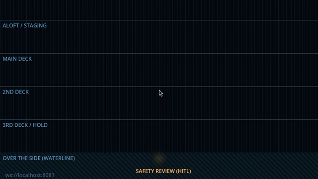
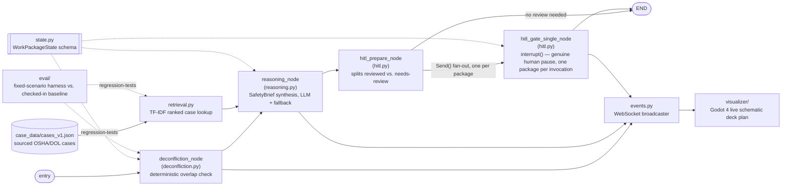

# watchstander

[](https://github.com/COSMOAGNOSTIC/watchstander/actions/workflows/tests.yml)
[](https://opensource.org/licenses/Apache-2.0)

A LangGraph-based multi-agent system for **OSHA 1915 (Shipyard Employment)** spatial and temporal safety deconfliction. Built by a 26-year Navy watchstander — this agent graph stands watch over shipyard safety the same way sailors stand watch over their ship.



Every deconfliction check, safety-brief synthesis, and HITL gate pause is broadcast as a WebSocket event ([`agent_core/events.py`](agent_core/events.py)) and rendered live in a 2D schematic deck plan ([`visualizer/`](visualizer/README.md)) built in Godot 4 — work packages appear where their real frame range and deck level place them, conflicts draw as red links, and a flagged package visibly waits at the Safety Review station until a human decides. See [ARCHITECTURE.md](ARCHITECTURE.md) Section 8 for why this is a generated schematic rather than an imported real ship drawing.

## What it does

Shipyard work packages (jobs, permits, tasks) carry spatial metadata — compartment, frame range, deck level, whether the work is aloft or over-the-side. The **Spatial Deconfliction Agent** evaluates concurrent work packages for hazardous overlap — hot work near an uncleared confined space, aloft work directly above unprotected personnel — and routes anything flagged to a mandatory **Human-in-the-Loop safety gate** before it can proceed.

Case grounding is sourced entirely from public OSHA/DOL records — real shipyard incidents, not synthetic examples. See `case_data/cases_v1.json` and `PASSDOWN.md` for sourcing detail and scope notes.

A second, site-scoped grounding source sits alongside the case data: a work package tagged with `governing_installation` (e.g. `"PSNS"`) is additionally cited against that installation's governing procedure — currently the public-domain NAVSEA 8010 Manual (fire prevention/hot work only) for PSNS. This is deliberately not a universal Navy-wide ruleset; a different installation or type command may operate under different governing instructions, and no installation's rules are assumed to apply anywhere they haven't been explicitly sourced. See `agent_core/procedural_lookup.py` and `case_data/navsea_8010_psns_v2014.json`.

## Architecture



- **`agent_core/state.py`** — `WorkPackageState` schema: hazard categories, spatial coordinates, required permits, risk level.
- **`agent_core/deconfliction.py`** — deterministic, testable overlap detection between work packages. Geometry-based, not LLM-dependent, so conflicts are auditable and repeatable.
- **`agent_core/retrieval.py`** — TF-IDF ranked case lookup grounding each flagged conflict in a real, sourced OSHA/DOL case.
- **`agent_core/procedural_lookup.py`** — site-scoped governing-procedure lookup (e.g. NAVSEA 8010 for `governing_installation="PSNS"`), distinct from case precedent — the rule that applies, not the incident it resembles.
- **`agent_core/reasoning.py`** — synthesizes a flagged conflict + its grounded case citation + its governing-procedure citation (if any) into a provenance-tagged `SafetyBrief`, with a deterministic zero-network fallback.
- **`agent_core/hitl.py`** — LangGraph `interrupt()`-based human review gate. Genuinely pauses graph execution; does not simulate review.
- **`agent_core/graph.py`** — graph assembly: `entry -> deconfliction -> reasoning -> hitl_gate -> END`.
- **`case_data/`** — sourced OSHA/DOL case histories (`cases_v1.json`) and site-scoped governing-procedure rulesets (`navsea_8010_psns_v2014.json`), tagged by hazard category, used to ground rationale generation.
- **`agent_core/events.py`** — lazy WebSocket broadcaster, no-op with no listener, feeding the visualizer.
- **`visualizer/`** — Godot 4 project rendering the graph's activity as a live schematic deck plan.
- **`reviewer/`** — local FastAPI app, the real human-facing Approve/Reject interface: full brief, LLM-vs-deterministic provenance, genuine `interrupt()`/`Command(resume=...)` (see ARCHITECTURE.md Section 8.5).
- **`eval/`** — fixed-scenario evaluation harness scoring the deterministic-fallback path against a checked-in baseline (see ARCHITECTURE.md Section 7).

## Watch It Live

`agent_core` broadcasts a WebSocket event at each stage of the graph — no configuration needed, it's a no-op until something connects. Open [`visualizer/`](visualizer/README.md) in Godot 4, run the main scene, then run [`visualizer/demo_broadcaster.py`](visualizer/demo_broadcaster.py) (no API key required) and watch work packages resolve through deconfliction, reasoning, and the Safety Review gate in real time — staged with real compartment names, deck levels, and frame positions from USCG Cutter ACUSHNET / ex-USS SHACKLE (ARS-9)'s public-domain HAER drawings, see [`docs/uscg-acushnet-ars9-source.md`](docs/uscg-acushnet-ars9-source.md). A separate static 3D blockout companion view (`visualizer/Main3D.tscn`) renders the same vessel's real compartment layout as a simplified hull — see [`visualizer/README.md`](visualizer/README.md#3d-blockout-companion-view-main3dtscn).

The visualizer only shows *that* a package is flagged, deliberately never *why* (see `events.py`'s broadcast policy, ARCHITECTURE.md Section 8). For the actual human decision — reading the full brief and clicking a real Approve/Reject — see [`reviewer/`](reviewer/README.md): `pip install -e ".[dev,reviewer]"`, `uvicorn reviewer.app:app --reload`, seed a real ACUSHNET run, and work the review queue for real.

## Project Docs

- [ARCHITECTURE.md](ARCHITECTURE.md) — component map, design principles, decision log
- [MIGRATION.md](MIGRATION.md) — phased build history with a definition of done per phase
- [PASSDOWN.md](PASSDOWN.md) — team roles and session-to-session continuity notes
- [AOSE.md](AOSE.md) — the adversarial review discipline behind this repo's fixes, with real instances from its own history

## Installation

```bash
pip install -e ".[dev]"
```

## Testing

```bash
pytest -v
```

GitHub Actions runs the full suite on Python 3.11 and 3.12 for every push and pull request.

## Sub-projects

- [`retrieval/`](retrieval/README.md) — a separate RAG (retrieval-augmented
  generation) skills-building harness applying semantic search + citation
  grounding to this repo's regulatory corpus. Standalone teaching project,
  not wired into the live deconfliction graph above; has its own phased
  plan and doc set — see [`retrieval/README.md`](retrieval/README.md).

## Scope (v1)

Public-domain, civilian shipyard OSHA data only. No Navy mishap data — deliberately excluded to avoid classification/aggregation concerns, not an oversight. See `PASSDOWN.md` Section 7 for the full out-of-scope list.

## License

MIT — see [LICENSE](LICENSE).
